# Docker images can be used by any container run time 


## Docker client options 


## portainer as docker webui 

```
docker run -d -p 8000:8000 -p 9000:9000 --name=portainer --restart=always -v /var/run/docker.sock:/var/run/docker.sock -v portainer_data:/data portainer/portainer-ce

```

### Docker SDK 

[docker SDK](https://docs.docker.com/engine/api/sdk/examples/)


### Docker network more points 


### custom subnet for docker bridge networking 

```
383  docker  network create  ashubr2  --subnet  192.168.100.0/24  
  384  docker  run -itd --name ashux111 --network  ashubr2  alpine 
  385  docker  ps
  386  history 
[ashu@ip-172-31-9-158 myimages]$ docker  run -itd --name ashux222 --network  ashubr2 --ip 192.168.100.200  alpine 
9509be5f46cacbe63309330bb3fcc19001a7e62c56e3813c291c665ad02bcbc3
[ashu@ip-172-31-9-158 myimages]$ docker exec -it  ashux222 sh 
/ # ifconfig 
eth0      Link encap:Ethernet  HWaddr 02:42:C0:A8:64:C8  
          inet addr:192.168.100.200  Bcast:192.168.100.255  Mask:255.255.255.0
          UP BROADCAST RUNNING MULTICAST  MTU:1500  Metric:1
          RX packets:6 errors:0 dropped:0 overruns:0 frame:0
          TX packets:0 errors:0 dropped:0 overruns:0 carrier:0
          collisions:0 txqueuelen:0 
          RX bytes:500 (500.0 B)  TX bytes:0 (0.0 B)

lo        Link encap:Local Loopback  
          inet addr:127.0.0.1  Mask:255.0.0.0
          UP LOOPBACK RUNNING  MTU:65536  Metric:1
          RX packets:0 errors:0 dropped:0 overruns:0 frame:0
          TX packets:0 errors:0 dropped:0 overruns:0 carrier:0
          collisions:0 txqueuelen:1000 
          RX bytes:0 (0.0 B)  TX bytes:0 (0.0 B)

/ # exit

```

### remove netowrk 

```
[ashu@ip-172-31-9-158 myimages]$ docker  network  prune 
WARNING! This will remove all custom networks not used by at least one container.
Are you sure you want to continue? [y/N] y
Deleted Networks:
shreyabr1
madhviBridge1
ishitab1
shailbr1
arjunnw
sivacnw
shwetabhbr1
riyanusubnet
ashubr1

```

## Storage in Docker 


### changing docker engine storage 

```
 27  mkfs.xfs  /dev/xvdf  
   28  mkdir  /oracle
   29  mount  /dev/xvdf   /oracle/
   30  cd  /etc/sysconfig/
   31  ls
   32  vim  docker
   33  history 
[root@ip-172-31-9-158 sysconfig]# ls
acpid       clock     docker          irqbalance  netconsole       raid-check     rpc-rquotad  selinux
atd         console   docker-storage  keyboard    network          rdisc          rsyncd       sshd
authconfig  cpupower  i18n            man-db      network-scripts  readonly-root  rsyslog      sysstat
chronyd     crond     init            modules     nfs              rpcbind        run-parts    sysstat.ioconf
[root@ip-172-31-9-158 sysconfig]# cat  docker
# The max number of open files for the daemon itself, and all
# running containers.  The default value of 1048576 mirrors the value
# used by the systemd service unit.
DAEMON_MAXFILES=1048576

# Additional startup options for the Docker daemon, for example:
# OPTIONS="--ip-forward=true --iptables=true"
# By default we limit the number of open files per container
OPTIONS="--default-ulimit nofile=1024:4096  -g /oracle"

# How many seconds the sysvinit script waits for the pidfile to appear
# when starting the daemon.
DAEMON_PIDFILE_TIMEOUT=10


[root@ip-172-31-9-158 sysconfig]# systemctl daemon-reload 
[root@ip-172-31-9-158 sysconfig]# systemctl restart  docker


```

### restore data from previous location 

```
 rsync -avp  /var/lib/docker/  /oracle/
 ```
 
 ### storage for containers
 
 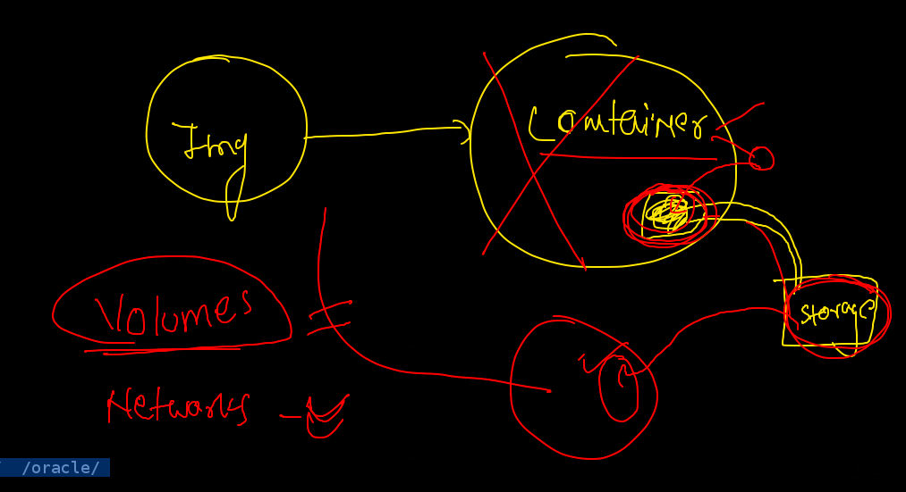
 
 ### creating container volume 
 
 ```
 [ashu@ip-172-31-9-158 myimages]$ docker  volume  create  ashuvol1
ashuvol1
[ashu@ip-172-31-9-158 myimages]$ docker  volume  ls
DRIVER    VOLUME NAME
local     ashuvol1

```

### checking volume 

```
[ashu@ip-172-31-9-158 myimages]$ docker  volume   inspect  ashuvol1 
[
    {
        "CreatedAt": "2021-08-11T06:17:39Z",
        "Driver": "local",
        "Labels": {},
        "Mountpoint": "/oracle/volumes/ashuvol1/_data",
        "Name": "ashuvol1",
        "Options": {},
        "Scope": "local"
    }
]

```

### attaching volume to container 

```
 405  docker  run  -it --name ashuvv1  oraclelinux:8.4
  406  docker  rm  ashuvv1
  407  docker  volume  create  ashuvol1
  408  docker  volume  ls
  409  docker  volume   inspect  ashuvol1 
  410  history 
  411  docker  volume  ls
  412  docker  run  -it  --name  ashuvv1  -v  ashuvol1:/mydata:rw    oraclelinux:8.4 
  413  docker  rm  ashuvv1  
  414  docker run -it --rm  -v  ashuvol1:/xyz  alipne  
  415  docker run -it --rm  -v  ashuvol1:/xyz  alpine 
  416  history 
[ashu@ip-172-31-9-158 myimages]$ docker  run  -it  --name  ashuvv1  -v  ashuvol1:/mydata:rw    oraclelinux:8.4
[root@1e65ae70d999 /]# cd  /mydata/
[root@1e65ae70d999 mydata]# ls
a.txt  hello  world
[root@1e65ae70d999 mydata]# mkdir  hii
[root@1e65ae70d999 mydata]# ls
a.txt  hello  hii  world
[root@1e65ae70d999 mydata]# exit
exit
[ashu@ip-172-31-9-158 myimages]$ docker  rm  ashuvv1 
ashuvv1

```

### volume sharing with multiple container 

```
[ashu@ip-172-31-9-158 myimages]$ docker  run  -it -v ashuvol1:/newdata:ro  centos  bash  
[root@286f93eec169 /]# cd  /newdata/
[root@286f93eec169 newdata]# ls
a.txt  hello  hii  world
[root@286f93eec169 newdata]# mkdir ok 
mkdir: cannot create directory 'ok': Read-only file system
[root@286f93eec169 newdata]# exit
exit

```

### sharing volume 

```
[ashu@ip-172-31-9-158 myimages]$ docker  run  -it -v ashuvol1:/newdata:ro  -v  ashuvol2:/mydata1:rw        centos  bash  
[root@47dbd896ea96 /]# ls
bin  etc   lib    lost+found  mnt      newdata  proc  run   srv  tmp  var
dev  home  lib64  media       mydata1  opt      root  sbin  sys  usr
[root@47dbd896ea96 /]# exit
exit

```

### sharing custom location as volume to container 

```
docker  run -itd --name ashungc1  -v  /home/ashu/myimages/beginner-html-site-styled:/usr/share/nginx/html:ro  -p 9988:80 nginx  

```


### cleaning up DE data 

```
 447  docker  rm  $(docker ps -aq) -f
  448  docker  volume  rm $(docker volume ls -q) -f
  449  docker  network prune 
  450  history 
[ashu@ip-172-31-9-158 myimages]$ docker  volume  ls
DRIVER    VOLUME NAME
[ashu@ip-172-31-9-158 myimages]$ docker  ps -a
CONTAINER ID   IMAGE     COMMAND   CREATED   STATUS    PORTS     NAMES
[ashu@ip-172-31-9-158 myimages]$ docker  network ls
NETWORK ID     NAME      DRIVER    SCOPE
c71bfa2cc77d   bridge    bridge    local
d87275337e54   host      host      local
4ea86dcdaf72   none      null      local

```

## Introduction to Docker compose 

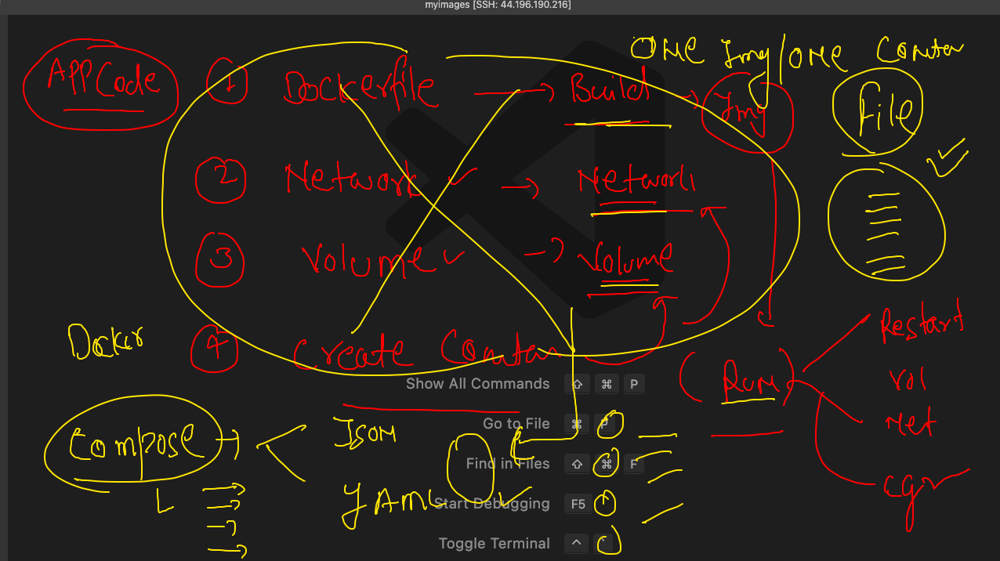

### Installing docker-compose in client side 

```
[ec2-user@ip-172-31-9-158 ~]$ sudo curl -L "https://github.com/docker/compose/releases/download/1.29.2/docker-compose-$(uname -s)
-$(uname -m)" -o /usr/local/bin/docker-compose
  % Total    % Received % Xferd  Average Speed   Time    Time     Time  Current
                                 Dload  Upload   Total   Spent    Left  Speed
100   633  100   633    0     0   5552      0 --:--:-- --:--:-- --:--:--  5552
100 12.1M  100 12.1M    0     0  44.0M      0 --:--:-- --:--:-- --:--:-- 44.0M
[ec2-user@ip-172-31-9-158 ~]$ sudo chmod +x /usr/local/bin/docker-compose
[ec2-user@ip-172-31-9-158 ~]$ sudo ln -s /usr/local/bin/docker-compose /usr/bin/docker-compose
[ec2-user@ip-172-31-9-158 ~]$ docker-compose  -v
docker-compose version 1.29.2, build 5becea4c

```

## COmpose installation URL 

[compose](https://docs.docker.com/compose/install/)

### example 1 

```
ashu@ip-172-31-9-158 myimages]$ cd  ashucompose1/
[ashu@ip-172-31-9-158 ashucompose1]$ ls
docker-compose.yaml
[ashu@ip-172-31-9-158 ashucompose1]$ docker-compose up  -d
Creating network "ashucompose1_default" with the default driver
Creating ashungc1 ... done
Creating ashuc1   ... done

```

### compose commands 

```
[ashu@ip-172-31-9-158 ashucompose1]$ docker-compose  ps
  Name                Command               State          Ports        
------------------------------------------------------------------------
ashuc1     ping localhost                   Up                          
ashungc1   /docker-entrypoint.sh ngin ...   Up      0.0.0.0:1133->80/tcp

```

### down 

```
[ashu@ip-172-31-9-158 ashucompose1]$ docker-compose  images
Container   Repository    Tag       Image Id       Size  
---------------------------------------------------------
ashuc1      alpine       latest   021b3423115f   5.595 MB
ashungc1    nginx        latest   08b152afcfae   133.2 MB
[ashu@ip-172-31-9-158 ashucompose1]$ docker-compose down 
Stopping ashungc1 ... done
Stopping ashuc1   ... done
Removing ashungc1 ... done
Removing ashuc1   ... done
Removing network ashucompose1_default

```

### compose commands 

```
 483  ls
  484  docker-compose  images
  485  docker-compose down 
  486  docker-compose up  -d
  487  docker-compose down 
  488  history 
  489  docker images
  490  docker-compose ps
  491  docker-compose  images
  492  docker  images
  493  docker-compose  up -d
  494  docker-compose  images
  495  docker-compose  down
  496  docker-compose  up -d
  497  docker-compose  images
  498  docker-compose  kill
  499  docker-compose  images
  500  docker-compose down 
  
  ```
  
  ## PRoblems with Docker  Engine 
  
  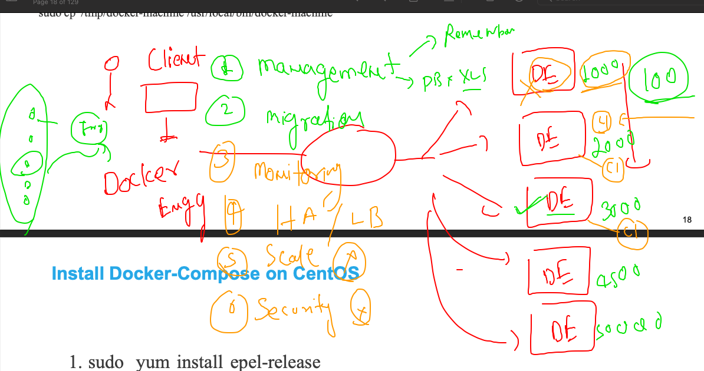
  
  ## COntainer orchestration 
  
  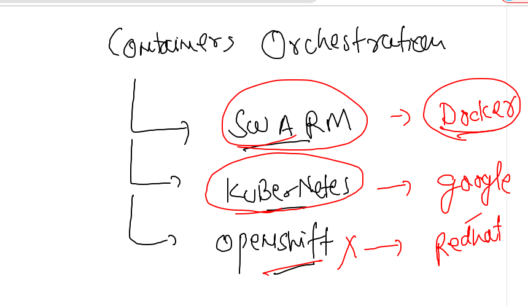
  
  ## k8s info 
  
  
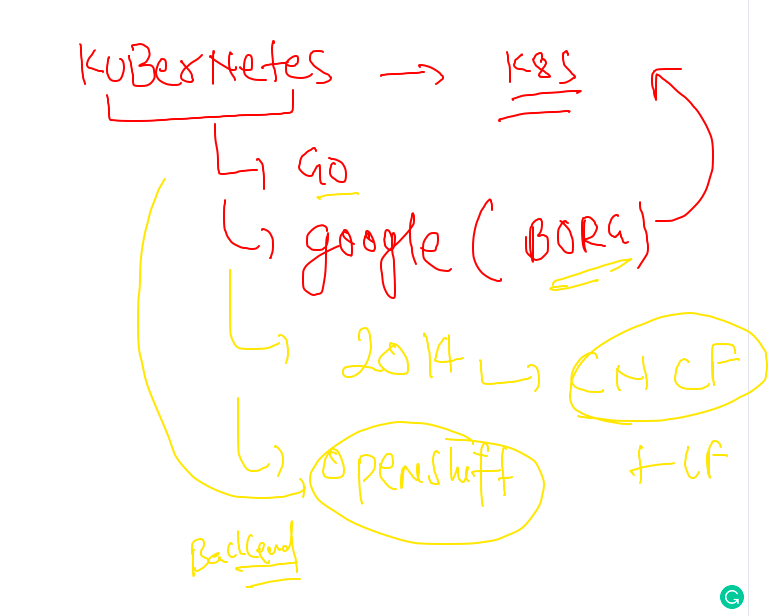


## Understanding k8s arch 

###  L1 

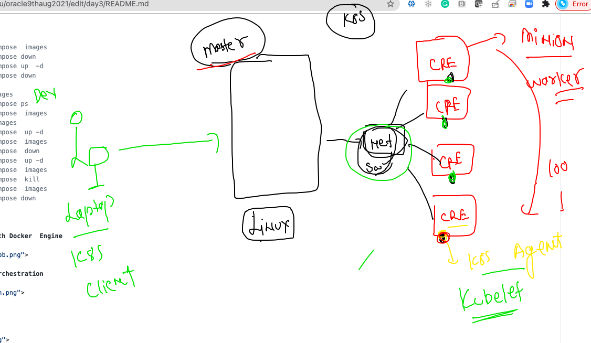

### L2

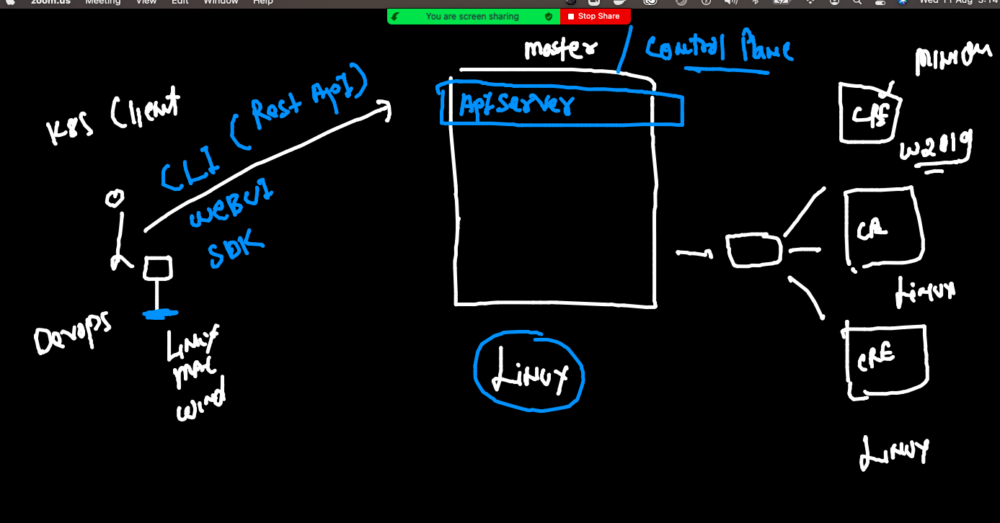

### Kube-apiserver in k8s master node

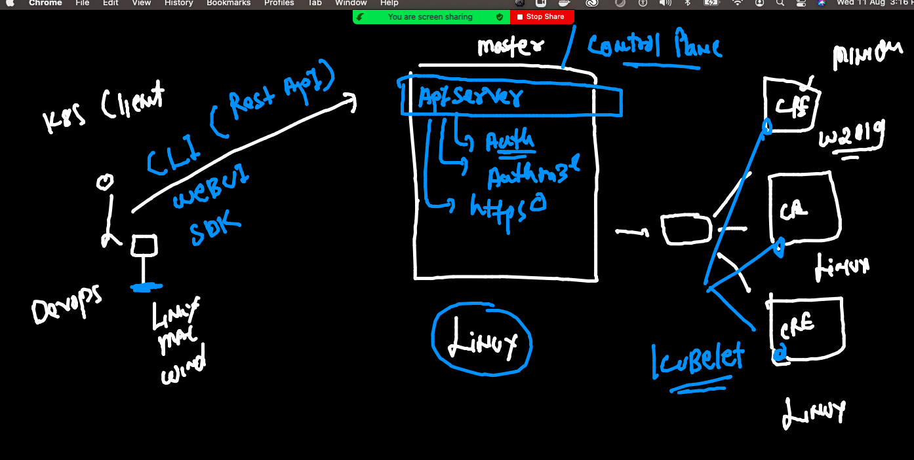

### Installation method for k8s

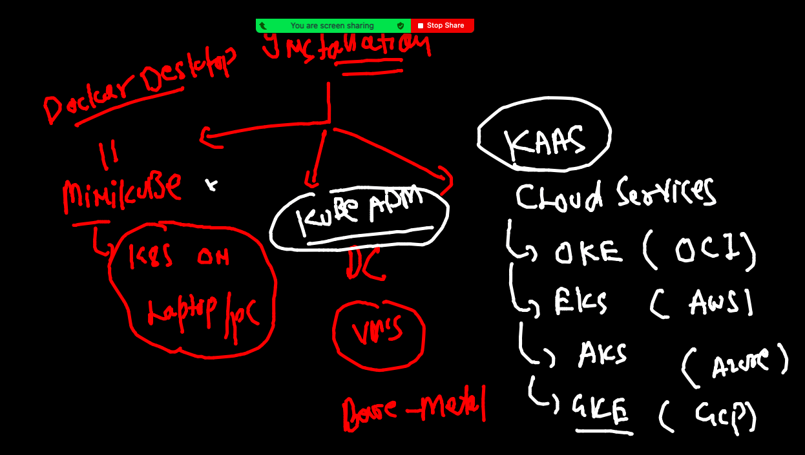

### Minikube 


### Installing kinikube 

```
❯ curl -LO https://storage.googleapis.com/minikube/releases/latest/minikube-darwin-amd64
  % Total    % Received % Xferd  Average Speed   Time    Time     Time  Current
                                 Dload  Upload   Total   Spent    Left  Speed
100 65.9M  100 65.9M    0     0  5532k      0  0:00:12  0:00:12 --:--:-- 5708k
❯ sudo install minikube-darwin-amd64 /usr/local/bin/minikube

Password:
❯ minikube version
minikube version: v1.22.0
commit: a03fbcf166e6f74ef224d4a63be4277d017bb62e

```

### Installing Minikube based k8s 

```

 minikube  start  --driver=docker
😄  minikube v1.22.0 on Darwin 11.4
✨  Using the docker driver based on user configuration
👍  Starting control plane node minikube in cluster minikube
🚜  Pulling base image ...
🔥  Creating docker container (CPUs=2, Memory=1988MB) ...
🐳  Preparing Kubernetes v1.21.2 on Docker 20.10.7 ...
    ▪ Generating certificates and keys ...
    ▪ Booting up control plane ...
    ▪ Configuring RBAC rules ...
🔎  Verifying Kubernetes components...
    ▪ Using image gcr.io/k8s-minikube/storage-provisioner:v5
🌟  Enabled addons: storage-provisioner, default-storageclass
🏄  Done! kubectl is now configured to use "minikube" cluster and "default" namespace by default

```
   
### k8s client version 

```

 kubectl  version --client
Client Version: version.Info{Major:"1", Minor:"21", GitVersion:"v1.21.1", GitCommit:"5e58841cce77d4bc13713ad2b91fa0d961e69192", GitTreeState:"clean", BuildDate:"2021-05-12T14:18:45Z", GoVersion:"go1.16.4", Compiler:"gc", Platform:"darwin/amd64"}

```

### COnnection to k8s client 

```
❯ cd  Desktop
❯ kubectl  get  nodes  --kubeconfig  admin.conf
NAME        STATUS   ROLES                  AGE   VERSION
k8smaster   Ready    control-plane,master   32m   v1.22.0
minion1     Ready    <none>                 32m   v1.22.0
minion2     Ready    <none>                 31m   v1.22.0
❯ 
❯ kubectl  get  nodes
NAME       STATUS   ROLES                  AGE   VERSION
minikube   Ready    control-plane,master   53m   v1.21.2
❯ 
❯ kubectl  get  nodes  --kubeconfig  admin.conf
NAME        STATUS   ROLES                  AGE   VERSION
k8smaster   Ready    control-plane,master   32m   v1.22.0
minion1     Ready    <none>                 32m   v1.22.0
minion2     Ready    <none>                 32m   v1.22.0

```

## admin.confg in right location 

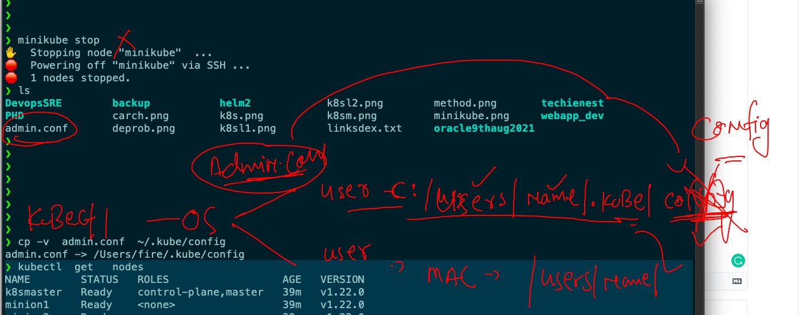

## switching context 

```
❯ kubectl  config  get-contexts
CURRENT   NAME                          CLUSTER      AUTHINFO           NAMESPACE
*         kubernetes-admin@kubernetes   kubernetes   kubernetes-admin   
          minikube                      minikube     minikube           default
❯ kubectl  config use-context minikube
Switched to context "minikube".
❯ kubectl  config  get-contexts
CURRENT   NAME                          CLUSTER      AUTHINFO           NAMESPACE
          kubernetes-admin@kubernetes   kubernetes   kubernetes-admin   
*         minikube                      minikube     minikube           default
❯ kubectl  get  nodes
NAME       STATUS   ROLES                  AGE   VERSION
minikube   Ready    control-plane,master   72m   v1.21.2
❯ kubectl  config use-context kubernetes-admin@kubernetes
Switched to context "kubernetes-admin@kubernetes".
❯ kubectl  get  nodes
NAME        STATUS   ROLES                  AGE   VERSION
k8smaster   Ready    control-plane,master   52m   v1.22.0
minion1     Ready    <none>                 52m   v1.22.0
minion2     Ready    <none>                 52m   v1.22.0

```


## ETCD 

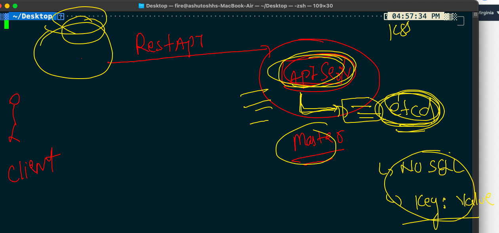

###  Intro to Pod 

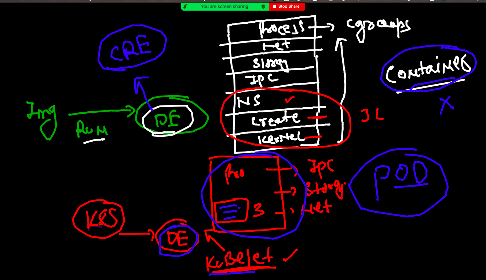


