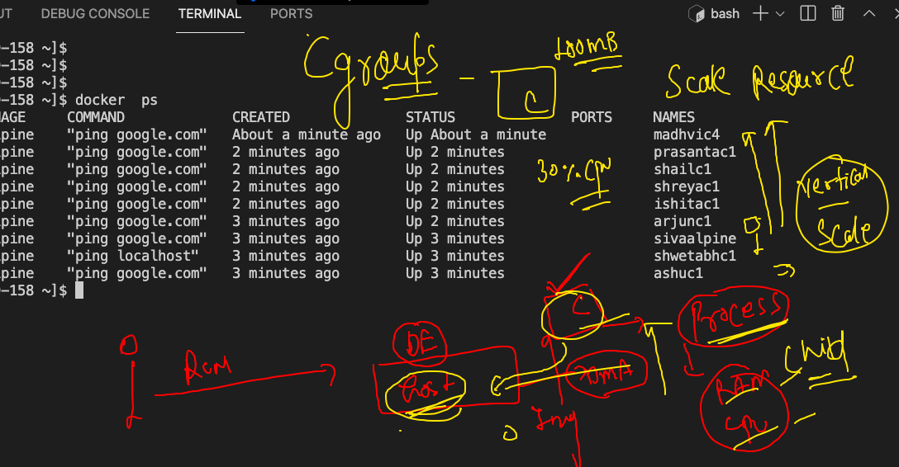
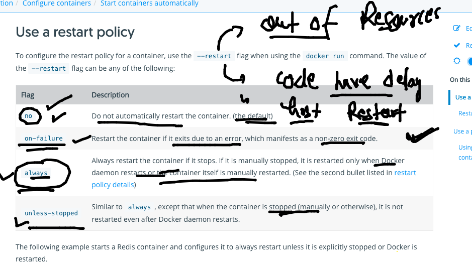

#  Namespace and cgroups 


## to remove all non running container 

```
 docker  rm  $(docker  ps  -aq)
 
 ```
 
## Introduction to vertical scaling of container along with cgroups 



## running child process and check resources 

```
 175  docker  run -itd  --name ashuc1  alpine ping google.com 
  176  docker  ps
  177  history 
  178  docker  stats
  179  history 
  180  docker  exec -itd  ashuc1  ping localhost 
  181  docker  stats
  182  docker  ps
  183  docker  top  ashuc1
  
 ```
 
 ### cgroups for memory limit 
 
 ```
  docker run -itd --name ashuc2 --memory 100m alpine ping fb.com
  
```

### ram with CPU limit

```
docker run -itd --name ashuc3 --memory 100m --cpu-shares=30 alpine ping fb.com

```

##  Restart policy in DOcker containers



### filter json output in container to check restart policy and other info 

```
ashu@ip-172-31-9-158 ~]$ docker  inspect  ashuc1  --format='{.Id}'
{.Id}
[ashu@ip-172-31-9-158 ~]$ docker  inspect  ashuc1  --format='{{.Id}}'
cf7e6d1a06ff1cfba7539cd2876e47faef41fc88459d5735f2add4e2ca88be65
[ashu@ip-172-31-9-158 ~]$ docker  inspect  ashuc1  --format='{{.State.Status}}'
running
[ashu@ip-172-31-9-158 ~]$ docker  inspect  ashuc2  --format='{{.State.Status}}'
running
[ashu@ip-172-31-9-158 ~]$ docker  inspect  ashuc2  --format='{{.HostConfig.RestartPolicy.Name}}'
no
[ashu@ip-172-31-9-158 ~]$ docker  inspect  ashuc1  --format='{{.HostConfig.RestartPolicy.Name}}'
no

```


## java code image building 

```
ashu@ip-172-31-9-158 javaapp]$ ls
Dockerfile  hello.java
[ashu@ip-172-31-9-158 javaapp]$ docker  build -t  ashujava:v1  . 
Sending build context to Docker daemon  3.072kB
Step 1/8 : FROM openjdk
 ---> c9022ce77bf9
Step 2/8 : LABEL name=ashutoshh
 ---> Running in 3fc535eafae9
Removing intermediate container 3fc535eafae9
 ---> 35a137384835
Step 3/8 : LABEL email=ashutoshh@linux.com
 ---> Running in 80aeaa95daa1
Removing intermediate container 80aeaa95daa1
 ---> 3a5ce0c1f7bc
Step 4/8 : RUN mkdir /jcode
 ---> Running in 85eded6c1c9c
Removing intermediate container 85eded6c1c9c
 ---> bfe4cd66a48c
Step 5/8 : COPY  hello.java  /jcode/hello.java
 ---> 86db73944f66
Step 6/8 : WORKDIR  /jcode
 ---> Running in 2abb030c960d
Removing intermediate container 2abb030c960d
 ---> 609edeab7ea4
Step 7/8 : RUN  javac  hello.java
 ---> Running in 3a7fe1e93d9b
Removing intermediate container 3a7fe1e93d9b
 ---> af841d71bb55
Step 8/8 : CMD  ["java","myclass"]
 ---> Running in e60136d6bcfb
Removing intermediate container e60136d6bcfb
 ---> 57f3ff77b778
Successfully built 57f3ff77b778
Successfully tagged ashujava:v1

```

### running java container 

```
[ashu@ip-172-31-9-158 javaapp]$ docker  run -itd --name ashujc1 ashujava:v1
4227d6762093bc45c79d994f56f93fb0fe83e6d5f1d86665aeed074ccc3dc00f
[ashu@ip-172-31-9-158 javaapp]$ docker  ps
CONTAINER ID   IMAGE            COMMAND          CREATED         STATUS         PORTS     NAMES
d5cdbc990ff0   javaappishi:v1   "java myclass"   3 seconds ago   Up 1 second              ishitac2
4227d6762093   ashujava:v1      "java myclass"   6 seconds ago   Up 5 seconds             ashujc1

```

### checking java jdk version inside contianer 

```
[ashu@ip-172-31-9-158 javaapp]$ docker  exec -it  ashujc1   bash 
bash-4.4# 
bash-4.4# 
bash-4.4# 
bash-4.4# 
bash-4.4# 
bash-4.4# 
bash-4.4# java -version 
openjdk version "16.0.2" 2021-07-20
OpenJDK Runtime Environment (build 16.0.2+7-67)
OpenJDK 64-Bit Server VM (build 16.0.2+7-67, mixed mode, sharing)
bash-4.4# exit
exit

```

### creating a temp container 

```
[ashu@ip-172-31-9-158 myimages]$ docker  run -it --rm  oraclelinux:8.4   bash 
[root@d6165548f9f2 /]# 
[root@d6165548f9f2 /]# dnf  search  jdk 
Oracle Linux 8 BaseOS Latest (x86_64)                                                          49 MB/s |  38 MB     00:00    
Oracle Linux 8 Application Stream (x86_64)                                                     54 MB/s |  26 MB     00:00    
Last metadata expiration check: 0:00:18 ago on Tue Aug 10 06:16:27 2021.
================================================ Name & Summary Matched: jdk =================================================
copy-jdk-configs.noarch : JDKs configuration files copier
copy-jdk-configs.src : JDKs configuration files copier
java-1.8.0-openjdk.src : OpenJDK 8 Runtime Environment
java-1.8.0-openjdk.x86_64 : OpenJDK 8 Runtime Environment
java-1.8.0-openjdk-accessibility.x86_64 : OpenJDK 8 accessibility connector
java-1.8.0-openjdk-demo.x86_64 : OpenJDK 8 Demos
java-1.8.0-openjdk-devel.x86_64 : OpenJDK 8 Development Environment
java-1.8.0-openjdk-headless.x86_64 : OpenJDK 8 Headless Runtime Environment
java-1.8.0-openjdk-javadoc.noarch : OpenJDK 8 API documentation
java-1.8.0-openjdk-javadoc-zip.noarch : OpenJDK 8 API documentation compressed in a single archive
java-1.8.0-openjdk-src.x86_64 : OpenJDK 8 Source Bundle
java-11-openjdk.src : OpenJDK 11 Runtime Environment

```

### jdk 

```
ashu@ip-172-31-9-158 myimages]$ cd  javaapp/
[ashu@ip-172-31-9-158 javaapp]$ ls
Dockerfile  hello.java  jdk8.dockerfile
[ashu@ip-172-31-9-158 javaapp]$ docker  build  -t  ashujava:v2  -f  jdk8.dockerfile  . 
Sending build context to Docker daemon  4.608kB
Step 1/9 : FROM oraclelinux:8.4
 ---> 6c0485cb8463
Step 2/9 : LABEL name=ashutoshh
 ---> Running in ae6ca4ee8225
Removing intermediate container ae6ca4ee8225
 ---> b39f11002bee
Step 3/9 : LABEL email=ashutoshh@linux.com
 ---> Running in c1598a53c05c
Removing intermediate container c1598a53c05c
 ---> 15f2382f803f
Step 4/9 : RUN dnf install java-1.8.0-openjdk.x86_64 java-1.8.0-openjdk-devel.x86_64 -y
 ---> Running in 8a2237b0f5e5
Oracle Linux 8 BaseOS Latest (x86_64)            53 MB/s |  38 MB     00:00 

```


