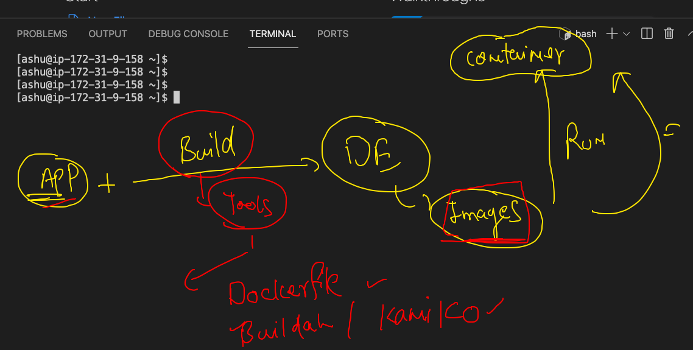
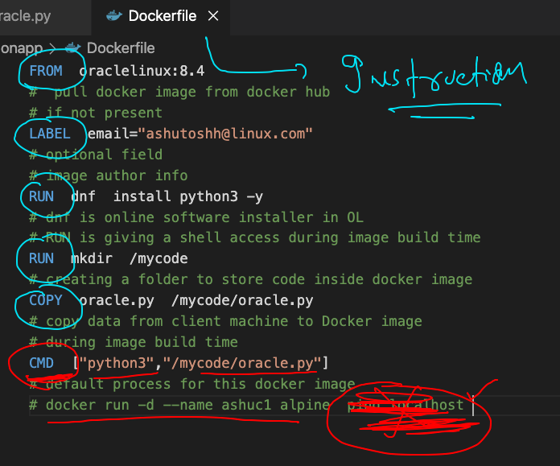
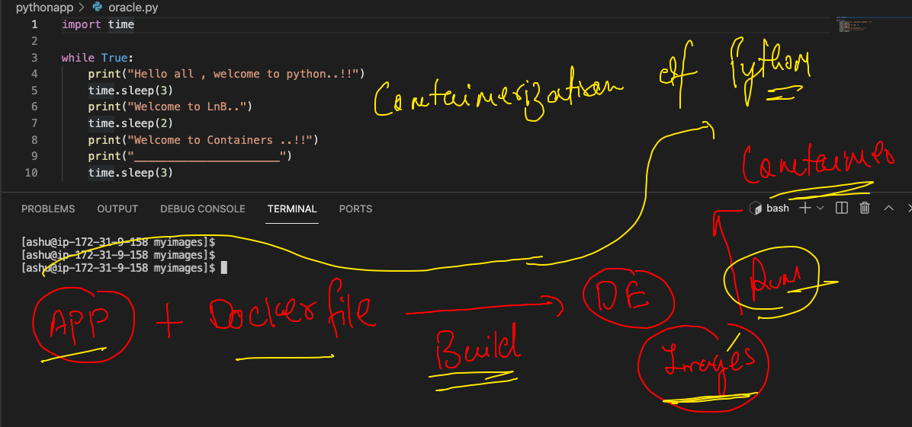

# check day1 to day5 branches for content 

## app deploy problem in past 


## Introduction  to VM 


## limit with vm 


## progress


## understanding oS kernel 


## Understanding little about container


## Introduction to CRE 


## Introduction to DOcker 


## docker start


## Docker Desktop 


## Docker Desktop for windows 10 

['Docker Desktop'](https://docs.docker.com/docker-for-windows/install/)

## Docker. installation on linux manually 

```
[ec2-user@ip-172-31-9-158 ~]$ sudo  yum  install docker  -y 

```

### checking docker version 

```
[ashu@ip-172-31-9-158 ~]$ docker  version 
Client:
 Version:           20.10.4
 API version:       1.41
 Go version:        go1.15.8
 Git commit:        d3cb89e
 Built:             Mon Mar 29 18:54:36 2021
 OS/Arch:           linux/amd64
 Context:           default
 Experimental:      true

Server:
 Engine:
  Version:          20.10.4
  API version:      1.41 (minimum version 1.12)
  Go version:       go1.15.8
  Git commit:       363e9a8
  Built:            Mon Mar 29 18:55:03 2021
  OS/Arch:          linux/amd64
  Experimental:     false
 containerd:
  Version:          1.4.6
  GitCommit:        d71fcd7d8303cbf684402823e425e9dd2e99285d
 runc:
  Version:          1.0.0
  GitCommit:        %runc_commit
 docker-init:
  Version:          0.19.0
  GitCommit:        de40ad0
  
```

## docker arch 


## registry options 


## Docker operations 

### search 

```
[ashu@ip-172-31-9-158 ~]$ docker  search   java 
NAME                                     DESCRIPTION                                     STARS     OFFICIAL   AUTOMATED
node                                     Node.js is a JavaScript-based platform for s…   10368     [OK]       
tomcat                                   Apache Tomcat is an open source implementati…   3089      [OK]       
openjdk                                  OpenJDK is an open-source implementation of …   2867      [OK]       
java                                     Java is a concurrent, class-based, and objec…   1976      [OK]       
ghost                                    Ghost is a free and open source blogging pla…   1398      [OK]       
couchdb                                  CouchDB is a database that uses JSON for doc…   430       [OK]       
jetty                                    Jetty provides a Web server and javax.servle…   369       [OK]       
groovy                                   Apache Groovy is a multi-faceted language fo…   113       [OK]       
lwieske/java-8                           Oracle

```

### pulling images

```
 9  docker  pull  mysql
   10  docker  pull   oraclelinux:8.3 
   11  history 
[ashu@ip-172-31-9-158 ~]$ docker  images
REPOSITORY    TAG       IMAGE ID       CREATED        SIZE
mysql         latest    c60d96bd2b77   2 weeks ago    514MB
oraclelinux   8.3       816d99f0bbe8   3 months ago   224MB

```

### all pulled images

```
[ashu@ip-172-31-9-158 ~]$ docker  images
REPOSITORY    TAG       IMAGE ID       CREATED        SIZE
alpine        latest    021b3423115f   2 days ago     5.6MB
nginx         latest    08b152afcfae   2 weeks ago    133MB
mysql         latest    c60d96bd2b77   2 weeks ago    514MB
busybox       latest    69593048aa3a   2 months ago   1.24MB
oraclelinux   8.3       816d99f0bbe8   3 months ago   224MB

```

### creating a new container 


### check list of running containers

```
[ashu@ip-172-31-9-158 ~]$ docker  ps
CONTAINER ID   IMAGE           COMMAND            CREATED          STATUS          PORTS     NAMES
ab50525e6760   alpine:latest   "ping localhost"   17 seconds ago   Up 16 seconds             ashuc1
```

### checking output of a container 

```
 40  docker  logs  ashuc1  
 
docker  logs  -f  ashuc1  

```

### Container resource consumption 

```
[ashu@ip-172-31-9-158 ~]$ docker  stats  


CONTAINER ID   NAME         CPU %     MEM USAGE / LIMIT     MEM %     NET I/O       BLOCK I/O   PIDS
d3f4a3140887   ishita       0.01%     656KiB / 7.788GiB     0.01%     850B / 0B     0B / 0B     1
6f2c9c68333c   prasct1      0.01%     716KiB / 7.788GiB     0.01%     850B / 0B     0B / 0B     1
84a115bdef61   shailendra   0.01%     744KiB / 7.788GiB     0.01%     850B / 0B     0B / 0B     1
75594a63f6ce   sivaalpine   0.01%     696KiB / 7.788GiB     0.01%     850B / 0B     0B / 0B     1
9551f8989817   madhvic1     0.01%     1.156MiB / 7.788GiB   0.01%     850B / 0B     0B / 0B     1
9de41e467f39   shreyac1     0.01%     724KiB / 7.788GiB     0.01%     850B / 0B     0B / 0B     1
ca1d91898cd8   arjun        0.01%     692KiB / 7.788GiB     0.01%     850B / 0B     0B / 0B     1
c9bbf7d8cadd   shwetabhc1   0.01%     724KiB / 7.788GiB     0.01%     920B / 0B     0B / 0B     1
ab50525e6760   ashuc1       0.01%     720KiB / 7.788GiB     0.01%     1.28kB / 0B   0B / 0B     1

```

### stop a running container 

```
[ashu@ip-172-31-9-158 ~]$ docker  stop   ashuc1   
ashuc1

```

### starting a stopped container

```
[ashu@ip-172-31-9-158 ~]$ docker  start  ashuc1 
ashuc1
[ashu@ip-172-31-9-158 ~]$ docker  ps
CONTAINER ID   IMAGE           COMMAND            CREATED          STATUS         PORTS     NAMES
ab50525e6760   alpine:latest   "ping localhost"   14 minutes ago   Up 7 seconds             ashuc1

```

### login into a running container 

```
[ashu@ip-172-31-9-158 ~]$ docker  exec  -it   ashuc1  sh  
/ # ls 
bin    dev    etc    home   lib    media  mnt    opt    proc   root   run    sbin   srv    sys    tmp    usr    var
/ # ifconfig 
eth0      Link encap:Ethernet  HWaddr 02:42:AC:11:00:02  
          inet addr:172.17.0.2  Bcast:172.17.255.255  Mask:255.255.0.0
          UP BROADCAST RUNNING MULTICAST  MTU:1500  Metric:1
          RX packets:13 errors:0 dropped:0 overruns:0 frame:0
          TX packets:0 errors:0 dropped:0 overruns:0 carrier:0
          collisions:0 txqueuelen:0 
          RX bytes:1030 (1.0 KiB)  TX bytes:0 (0.0 B)

lo        Link encap:Local Loopback  
          inet addr:127.0.0.1  Mask:255.0.0.0
          UP LOOPBACK RUNNING  MTU:65536  Metric:1
          RX packets:918 errors:0 dropped:0 overruns:0 frame:0
          TX packets:918 errors:0 dropped:0 overruns:0 carrier:0
          collisions:0 txqueuelen:1000 
          RX bytes:77112 (75.3 KiB)  TX bytes:77112 (75.3 KiB)

/ # exit

```
### to check all the process running in a container 

```
[ashu@ip-172-31-9-158 ~]$ docker  top  ashuc1
UID                 PID                 PPID                C                   STIME               TTY                 TIME                CMD
root                13999               13957               0                   08:55               ?                   00:00:00            ping localhost

```

### stopping all running containers

```
[ashu@ip-172-31-9-158 ~]$ docker  kill  $(docker  ps -q)
bc7d9dde787b
d6a1e647f43b
00b3af9df8f7
4e55677e3d87
22cc9ea37c10
d80bb9501835
0e25de32b553
a06681663948
a3e596f3c51b
44ff6067f5ad
f9663da6e421
05864e91023f
a3ff9fec69ac
906bce3ccff4
87978d631fd2
fa13f65d88e6
d3f4a3140887
6f2c9c68333c
75594a63f6ce
9551f8989817
9de41e467f39
ca1d91898cd8
c9bbf7d8cadd
[ashu@ip-172-31-9-158 ~]$ docker  ps 
CONTAINER ID   IMAGE     COMMAND   CREATED   STATUS    PORTS     NAMES
[ashu@ip-172-31-9-158 ~]$ 


```

### remove all stopped containers

```
 docker  rm  $(docker  ps -aq) 
 
```

## Docker image build process



### dockerfile explanation 



### building docker images

```
[ashu@ip-172-31-9-158 myimages]$ docker  build -t  ashupyhon:v1  ./pythonapp  
Sending build context to Docker daemon  3.584kB
Step 1/6 : FROM  oraclelinux:8.4
8.4: Pulling from library/oraclelinux
560ca3a48139: Pull complete 
Digest: sha256:bf974de16aed323b73de50c333885e453c9f9009c0fb8bef9418d8cabc9ab155
Status: Downloaded newer image for oraclelinux:8.4
 ---> 6c0485cb8463
Step 2/6 : LABEL  email="ashutoshh@linux.com"
 ---> Running in 1f6f0f7499ba
Removing intermediate container 1f6f0f7499ba
 ---> 209e8093ea86
Step 3/6 : RUN  dnf  install python3 -y
 ---> Running in 24ecb739850c
Oracle Linux 8 BaseOS Latest (x86_64)            67 MB/s |  38 MB     00:00    
Oracle Linux 8 Application Stream (x86_64)       75 MB/s |  26 MB     00:00    
Last metadata expiration check: 0:00:07 ago on Mon Aug  9 10:21:16 2021.
Dependencies resolved.
=================================================================================================
 Package               Arch    Version                                   Repository          Size
=================================================================================================
Installing:
 python36              x86_64  3.6.8-2.0.1.module+el8.4.0+20103+1849b5f9 ol8_appstream       19 k
Installing dependencies:
 platform-python-pip   noarch  9.0.3-19.el8                              ol8_baseos_latest  1.7 M
 python3-pip           noarch  9.0.3-19.el8                              ol8_appstream       20 k
 python3-setuptools    noarch  39.2.0-6.el8                              ol8_baseos_latest  163 k
Enabling module streams:
 python36                      3.6                                                               

Transaction Summary
=================================================================================================
Install  4 Packages

Total download size: 1.9 M
Installed size: 7.6 M
Downloading Packages:
(1/4): python3-pip-9.0.3-19.el8.noarch.rpm      442 kB/s |  20 kB     00:00    
(2/4): platform-python-pip-9.0.3-19.el8.noarch.  29 MB/s | 1.7 MB     00:00    
(3/4): python36-3.6.8-2.0.1.module+el8.4.0+2010 1.4 MB/s |  19 kB     00:00    
(4/4): python3-setuptools-39.2.0-6.el8.noarch.r 637 kB/s | 163 kB     00:00    
--------------------------------------------------------------------------------
Total                                           7.2 MB/s | 1.9 MB     00:00     
Running transaction check
Transaction check succeeded.
Running transaction test
Transaction test succeeded.
Running transaction
  Preparing        :                                                        1/1 
  Installing       : python3-setuptools-39.2.0-6.el8.noarch                 1/4 
  Installing       : platform-python-pip-9.0.3-19.el8.noarch                2/4 
  Installing       : python36-3.6.8-2.0.1.module+el8.4.0+20103+1849b5f9.x   3/4 
  Running scriptlet: python36-3.6.8-2.0.1.module+el8.4.0+20103+1849b5f9.x   3/4 
  Installing       : python3-pip-9.0.3-19.el8.noarch                        4/4 
  Running scriptlet: python3-pip-9.0.3-19.el8.noarch                        4/4 
  Verifying        : platform-python-pip-9.0.3-19.el8.noarch                1/4 
  Verifying        : python3-setuptools-39.2.0-6.el8.noarch                 2/4 
  Verifying        : python3-pip-9.0.3-19.el8.noarch                        3/4 
  Verifying        : python36-3.6.8-2.0.1.module+el8.4.0+20103+1849b5f9.x   4/4 

Installed:
  platform-python-pip-9.0.3-19.el8.noarch                                       
  python3-pip-9.0.3-19.el8.noarch                                               
  python3-setuptools-39.2.0-6.el8.noarch                                        
  python36-3.6.8-2.0.1.module+el8.4.0+20103+1849b5f9.x86_64                     

Complete!
Removing intermediate container 24ecb739850c
 ---> 7612373d9674
Step 4/6 : RUN  mkdir  /mycode
 ---> Running in ecdb820919c7
Removing intermediate container ecdb820919c7
 ---> c5776b1cddc5
Step 5/6 : COPY  oracle.py  /mycode/oracle.py
 ---> 030ba21af8eb
Step 6/6 : CMD  ["python3","/mycode/oracle.py"]
 ---> Running in 19b167d4e217
Removing intermediate container 19b167d4e217
 ---> 4edcbc4ed676
Successfully built 4edcbc4ed676
Successfully tagged ashupyhon:v1

```

### creating container 

```
[ashu@ip-172-31-9-158 myimages]$ docker  run  -itd  --name ashuc2  ashupyhon:v1  
773d4449e15ab67358e66ece4c692837b691faf7720dbdf43cee31d52b6399cd
[ashu@ip-172-31-9-158 myimages]$ docker  ps
CONTAINER ID   IMAGE             COMMAND                  CREATED          STATUS          PORTS     NAMES
c6691103d32b   madhvipython:v1   "python3 /mycode/ora…"   5 seconds ago    Up 3 seconds              madhvic3
773d4449e15a   ashupyhon:v1      "python3 /mycode/ora…"   8 seconds ago    Up 6 seconds              ashuc2
243df2ca6b0b   rajpythonapp:v1   "python3 /mycode/ora…"   16 seconds ago   Up 14 seconds             RajPythonApp

```

###  python app containerization 



### building docker image for python in another way ...

```
[ashu@ip-172-31-9-158 pythonapp]$ ls
Dockerfile  oracle.py  python1.dockerfile
[ashu@ip-172-31-9-158 pythonapp]$ docker  build  -t  ashupython:v2  -f python1.dockerfile   .  
Sending build context to Docker daemon  4.608kB
Step 1/5 : FROM  python
latest: Pulling from library/python
627b765e08d1: Pull complete 
c040670e5e55: Pull complete 
073a180f4992: Pull complete 
bf76209566d0: Pull complete 
ca7044ed766e: Pull complete 
7b16520e0e66: Pull complete 
e121e5a178df: Pull complete 
abbaf10bd160: Pull complete 
17cd945c5d4d: Pull complete 
Digest: sha256:7a93befe45f3afb6b3377c91ef1e8b28e7b84dc70bbb43fc723415d1ad613bdc
Status: Image is up to date for python:latest
 ---> 59433749a9e3
Step 2/5 : LABEL  email="ashutoshh@linux.com"
 ---> Running in 1c4dd547ab76
Removing intermediate container 1c4dd547ab76
 ---> cacb52a40830
Step 3/5 : RUN  mkdir  /mycode
 ---> Running in 0049f42c745c
Removing intermediate container 0049f42c745c
 ---> 622bb6d8b698
Step 4/5 : COPY  oracle.py  /mycode/oracle.py
 ---> a7aba2561ccc
Step 5/5 : CMD  ["python","/mycode/oracle.py"]
 ---> Running in 006d80ad7eb1
Removing intermediate container 006d80ad7eb1
 ---> 235e364ea6f7
Successfully built 235e364ea6f7
Successfully tagged ashupython:v2

```

## checking image build history 
```
[ashu@ip-172-31-9-158 pythonapp]$ docker  history  ashupyhon:v1  
IMAGE          CREATED          CREATED BY                                      SIZE      COMMENT
4edcbc4ed676   55 minutes ago   /bin/sh -c #(nop)  CMD ["python3" "/mycode/o…   0B        
030ba21af8eb   55 minutes ago   /bin/sh -c #(nop) COPY file:6e29d47c004b1169…   231B      
c5776b1cddc5   55 minutes ago   /bin/sh -c mkdir  /mycode                       0B        
7612373d9674   55 minutes ago   /bin/sh -c dnf  install python3 -y              146MB     
209e8093ea86   55 minutes ago   /bin/sh -c #(nop)  LABEL email=ashutoshh@lin…   0B        
6c0485cb8463   2 weeks ago      /bin/sh -c #(nop)  CMD ["/bin/bash"]            0B        
<missing>      2 weeks ago      /bin/sh -c #(nop) ADD file:22e24f7ea9b05c694…   247MB     

```

### Building docker. image for python 

```
docker  build  -t  ashupython:v3  -f  pythonalpine.dockerfile  .

```


