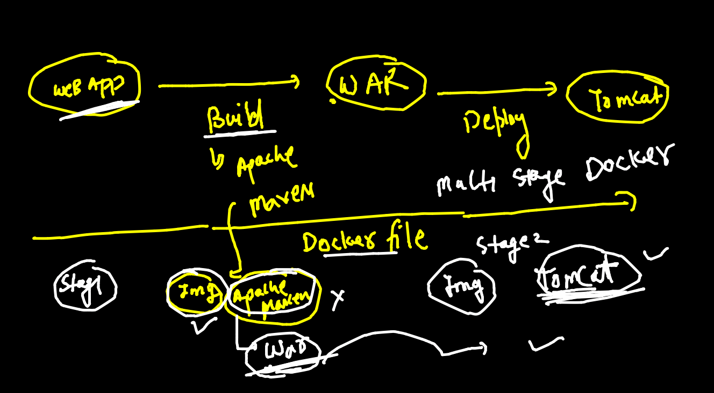
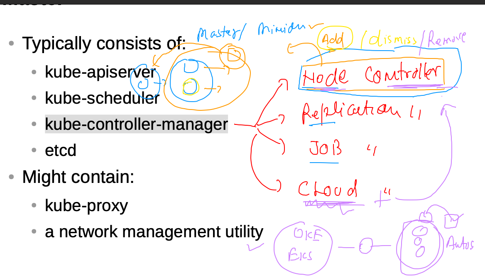
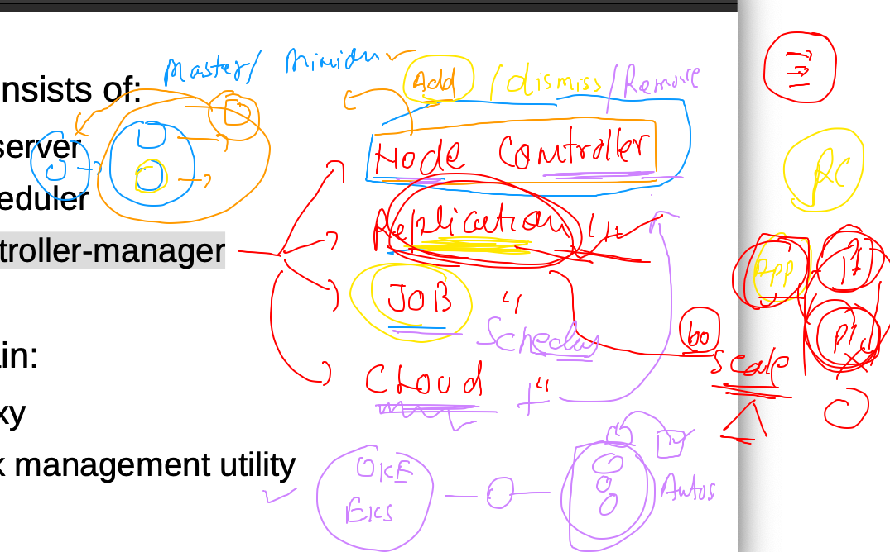
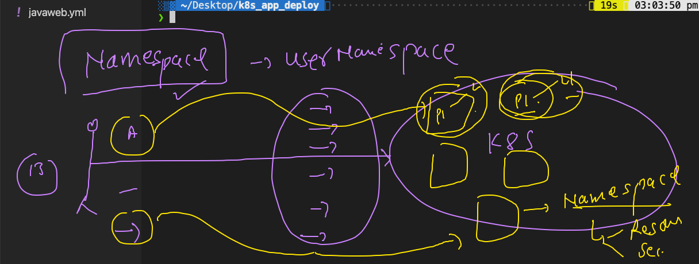

# POD understanding 


## checking k8s connection 

```
❯ kubectl  get  nodes
NAME        STATUS   ROLES                  AGE   VERSION
k8smaster   Ready    control-plane,master   17h   v1.22.0
minion1     Ready    <none>                 17h   v1.22.0
minion2     Ready    <none>                 17h   v1.22.0
❯ kubectl  config get-contexts
CURRENT   NAME                          CLUSTER      AUTHINFO           NAMESPACE
*         kubernetes-admin@kubernetes   kubernetes   kubernetes-admin   
          minikube                      minikube     minikube           default
❯ kubectl  config use-contexts  kubernetes-admin@kubernetes
error: unknown command "use-contexts kubernetes-admin@kubernetes"
See 'kubectl config -h' for help and examples
❯ kubectl  config use-context  kubernetes-admin@kubernetes
Switched to context "kubernetes-admin@kubernetes".
❯ 
❯ kubectl  get  nodes
NAME        STATUS   ROLES                  AGE   VERSION
k8smaster   Ready    control-plane,master   17h   v1.22.0
minion1     Ready    <none>                 17h   v1.22.0
minion2     Ready    <none>                 17h   v1.22.0

░▒▓ ~ ······························································································· 09:48:21 AM ▓▒░─╮
❯                                                                                                                      ─╯


❯ 
❯ 
❯ kubectl  cluster-info
Kubernetes control plane is running at https://52.71.191.102:6443
CoreDNS is running at https://52.71.191.102:6443/api/v1/namespaces/kube-system/services/kube-dns:dns/proxy

To further debug and diagnose cluster problems, use 'kubectl cluster-info dump'.

```

## POD examples 

### example 1 


### checking yaml syntax 

```
❯ kubectl  apply -f  ashupod1.yaml --dry-run=client
pod/ashupod-123 created (dry run)

```

### deploy pod yaml 

```
❯ kubectl  apply -f  ashupod1.yaml
pod/ashupod-123 created
❯ kubectl  get   pods
NAME          READY   STATUS              RESTARTS   AGE
arjunpod      0/1     ContainerCreating   0          0s
ashupod-123   1/1     Running             0          24s

```

## pod scheduling 


### checking node of pod 

```
❯ kubectl  get  po  ashupod-123  -o wide
NAME          READY   STATUS    RESTARTS   AGE    IP                NODE      NOMINATED NODE   READINESS GATES
ashupod-123   1/1     Running   0          9m4s   192.168.179.193   minion2   <none>           <none>

```

## POd internal information 

```
❯ kubectl  describe pod  ashupod-123
Name:         ashupod-123
Namespace:    default
Priority:     0
Node:         minion2/172.31.15.179
Start Time:   Thu, 12 Aug 2021 10:04:07 +0530
Labels:       <none>
Annotations:  cni.projectcalico.org/containerID: 581331b109dc167604b9844955cc4e879f1b013c6caee7e0ff223d5c4b434ab2
              cni.projectcalico.org/podIP: 192.168.179.193/32
              cni.projectcalico.org/podIPs: 192.168.179.193/32
Status:       Running
IP:           192.168.179.193
IPs:
  IP:  192.168.179.193
Containers:
  ashuc1:
    Container ID:  docker://3f2a8b6ae8338a70fec764baec72b99fff9262fc711458ba1181c87ad8412237
    Image:         alpine
    Image ID:      docker-pullable://alpine@sha256:eb3e4e175ba6d212ba1d6e04fc0782916c08e1c9d7b45892e9796141b1d379ae
    Port:          <none>
    Host Port:     <none>
    
    
    
```

### checking logs / output of process of container inside pod 

```
2563  kubectl  logs  ashupod-123 
 2564  kubectl  logs -f  ashupod-123 
 
```
### accessing container inside pod 

```
❯ kubectl  exec  -it  ashupod-123   -- sh
/ # 
/ # 
/ # 
/ # cat  /etc/os-release 
NAME="Alpine Linux"
ID=alpine
VERSION_ID=3.14.1
PRETTY_NAME="Alpine Linux v3.14"
HOME_URL="https://alpinelinux.org/"
BUG_REPORT_URL="https://bugs.alpinelinux.org/"
/ # ls
bin    dev    etc    home   lib    media  mnt    opt    proc   root   run    sbin   srv    sys    tmp    usr    var
/ # exit

```

### POd deletion 

```
❯ kubectl  delete  pod  ashupod-123
pod "ashupod-123" deleted

```

### Auto generate yAMl for POD 

```
❯ kubectl  run ashupod2  --image=dockerashu/ashuhttpd:v1  --port 80  --dry-run=client -o  yaml
apiVersion: v1
kind: Pod
metadata:
  creationTimestamp: null
  labels:
    run: ashupod2
  name: ashupod2
spec:
  containers:
  - image: dockerashu/ashuhttpd:v1
    name: ashupod2
    ports:
    - containerPort: 80
    resources: {}
  dnsPolicy: ClusterFirst
  restartPolicy: Always
status: {}
❯ kubectl  run ashupod2  --image=dockerashu/ashuhttpd:v1  --port 80  --dry-run=client -o  yaml  >ashupod2.yaml

```

### POD networking 


## accessing POD app

### when you are k8s client 

```
❯ kubectl  port-forward  ashupod2   1234:80
Forwarding from 127.0.0.1:1234 -> 80
Forwarding from [::1]:1234 -> 80
Handling connection for 1234
Handling connection for 1234

```

### when you are end user

## enduse need static endpoint 

### Introduction to service 


### svc use label of pod to forward traffic 


## type of service 


### NodePort svc


### checking label of POD 

```
❯ kubectl  get  po  ashupod2  --show-labels
NAME       READY   STATUS    RESTARTS   AGE   LABELS
ashupod2   1/1     Running   0          97m   run=ashupod2
❯ kubectl  apply -f  ashupod2.yaml
pod/ashupod2 configured
❯ kubectl  get  po  ashupod2  --show-labels
NAME       READY   STATUS    RESTARTS   AGE   LABELS
ashupod2   1/1     Running   0          98m   x=helloashuapp


```

### creating service nodeport yaml 

```
❯ kubectl  create  service    nodeport   ashusvc1  --tcp  1234:80   --dry-run=client -o yaml
apiVersion: v1
kind: Service
metadata:
  creationTimestamp: null
  labels:
    app: ashusvc1
  name: ashusvc1
spec:
  ports:
  - name: 1234-80
    port: 1234
    protocol: TCP
    targetPort: 80
  selector:
    app: ashusvc1
  type: NodePort
status:
  loadBalancer: {}
❯ kubectl  create  service    nodeport   ashusvc1  --tcp  1234:80   --dry-run=client -o yaml   >ashusvc.yaml

```

### Deploy svc nodeport 


###  deleting pods 

```
❯ kubectl delete  pod --all
pod "arjunpod" deleted
pod "arjunpod2" deleted
pod "ashupod2" deleted
pod "ishita-123" deleted
pod "ishitapod2" deleted
pod "prasanta-123" deleted
pod "praspod2" deleted

```

### deleting all svc 

```
 kubectl delete svc   --all
service "arjunsvc1" deleted
service "ashusvc1" deleted
service "ishitas1" deleted
service "kubernetes" deleted
service "prasantasvc2" deleted
service "riyanuservice1" deleted
service "shailsvc2" deleted
service "shreyasvc1" deleted

```

### Intro to multi stage dockerfile



### build java sprint 

```
 git clone https://github.com/redashu/java-springboot
  504  ls
  505  cd  java-springboot/
  506  ls
  507  docker  build -t   javawebapp:12thaugv1 . 
  508  history 
  509  doker  imags
  510  docker  images
  511  docker   tag  17f363b89481  dockerashu/javawebapp:12thaugv1 
  512  docker  login -u dockerashu
  513  docker push  dockerashu/javawebapp:12thaugv1  
  514  history 
  515  docker  logout 
  
 ```
 
 ## creating java pod 
 
 ```
  kubectl  run   ashujavapod  --image=dockerashu/javawebapp:12thaugv1  --port 8080 --dry-run=client -o yaml
apiVersion: v1
kind: Pod
metadata:
  creationTimestamp: null
  labels:
    run: ashujavapod
  name: ashujavapod
spec:
  containers:
  - image: dockerashu/javawebapp:12thaugv1
    name: ashujavapod
    ports:
    - containerPort: 8080
    resources: {}
  dnsPolicy: ClusterFirst
  restartPolicy: Always
status: {}
❯ kubectl  run   ashujavapod  --image=dockerashu/javawebapp:12thaugv1  --port 8080 --dry-run=client -o yaml   >javaweb.yml

```

### creating svc for same pod 

```
 kubectl  create   service nodeport  ashujavasvc --tcp 1234:8080  --dry-run=client -o yaml
apiVersion: v1
kind: Service
metadata:
  creationTimestamp: null
  labels:
    app: ashujavasvc
  name: ashujavasvc
spec:
  ports:
  - name: 1234-8080
    port: 1234
    protocol: TCP
    targetPort: 8080
  selector:
    app: ashujavasvc
  type: NodePort
status:
  loadBalancer: {}

```

### deploy pod 

```
❯ kubectl  apply -f  javaweb.yml
pod/ashujavapod created
service/ashujavasvc created
❯ kubectl  get  po
NAME          READY   STATUS              RESTARTS   AGE
ashujavapod   0/1     ContainerCreating   0          7s
❯ kubectl  get  svc
NAME          TYPE        CLUSTER-IP     EXTERNAL-IP   PORT(S)          AGE
ashujavasvc   NodePort    10.99.164.22   <none>        1234:30560/TCP   9s
kubernetes    ClusterIP   10.96.0.1      <none>        443/TCP          26s
❯ kubectl  get  po
NAME          READY   STATUS    RESTARTS   AGE
ashujavapod   1/1     Running   0          21s


```

## Node COntroller 



##  RC -- 




### clean up 

```
❯ kubectl  delete  all --all
pod "arjunpod2" deleted
pod "ashujavapod" deleted
pod "ishitajavapod" deleted
pod "prasantajavapod2" deleted
pod "rajsprintboot" deleted
pod "shailendrajavaweb" deleted
pod "shreyajavapod" deleted
pod "sivajavapod" deleted
pod "vvtjavapod" deleted
service "arjunjavasvc" deleted
service "ashujavasvc" deleted
service "ishitajavasvc" deleted
service "kubernetes" deleted
service "prasajavasvc" deleted
service "rajspringbootservice" deleted
service "shailjavasvc" deleted
service "shreyajavasvc1" deleted

```

## Namespace 



```
❯ kubectl  get  ns
NAME              STATUS   AGE
default           Active   23h
kube-node-lease   Active   23h
kube-public       Active   23h
kube-system       Active   23h
❯ kubectl  get  po
No resources found in default namespace.

```

## k8s internal 

```
❯ kubectl  get  po  -n  kube-system
NAME                                       READY   STATUS    RESTARTS      AGE
calico-kube-controllers-58497c65d5-845j7   1/1     Running   1 (21h ago)   23h
calico-node-kkqds                          1/1     Running   1 (21h ago)   23h
calico-node-mvsf7                          1/1     Running   1 (21h ago)   23h
calico-node-nj9bt                          1/1     Running   1 (21h ago)   23h
coredns-78fcd69978-jn27m                   1/1     Running   1 (21h ago)   23h
coredns-78fcd69978-n2rpr                   1/1     Running   1 (21h ago)   23h
etcd-k8smaster                             1/1     Running   1 (21h ago)   23h
kube-apiserver-k8smaster                   1/1     Running   1 (21h ago)   23h
kube-controller-manager-k8smaster          1/1     Running   1 (21h ago)   23h
kube-proxy-j5lxw                           1/1     Running   1 (21h ago)   23h
kube-proxy-lb7bz                           1/1     Running   1 (21h ago)   23h
kube-proxy-vq2b2                           1/1     Running   1 (21h ago)   23h
kube-scheduler-k8smaster                   1/1     Running   1 (21h ago)   23h


```

## creating ns

```
❯ kubectl  create  namespace   ashu-space
namespace/ashu-space created
❯ 
❯ 
❯ 
❯ kubectl  get  ns
NAME              STATUS   AGE
ashu-space        Active   16s
default           Active   23h
ishita-ns         Active   2s
kube-node-lease   Active   23h
kube-public       Active   23h
kube-system       Active   23h
raj-space         Active   1s
shwetabh-space    Active   2s

```

## 

```
❯ kubectl  delete all --all  -n  ashu-space
pod "ashujavapod" deleted
service "ashujavasvc" deleted
```

### pod in ns

```
❯ kubectl  apply -f  ashupod1.yaml  -n  ashu-space
pod/ashupod-123 created
❯ kubectl  get  po  -n ashu-space
NAME          READY   STATUS    RESTARTS   AGE
ashupod-123   1/1     Running   0          19s
```

### setting namespace permanently 

```
❯ kubectl  config  get-contexts
CURRENT   NAME                          CLUSTER      AUTHINFO           NAMESPACE
*         kubernetes-admin@kubernetes   kubernetes   kubernetes-admin   
          minikube                      minikube     minikube           default
❯ kubectl  config set-context  --current --namespace=ashu-space
Context "kubernetes-admin@kubernetes" modified.
❯ 
❯ kubectl  config  get-contexts
CURRENT   NAME                          CLUSTER      AUTHINFO           NAMESPACE
*         kubernetes-admin@kubernetes   kubernetes   kubernetes-admin   ashu-space
          minikube                      minikube     minikube           default

❯ kubectl  get  po
NAME          READY   STATUS    RESTARTS   AGE
ashupod-123   1/1     Running   0          2m45s
❯ kubectl  get  svc
No resources found in ashu-space namespace.


```


 ## RC 
 
 ```
 ❯ ls
ashupod1.yaml ashupod2.yaml ashurc1.yaml  ashusvc.yaml  javaweb.yml
❯ kubectl apply -f  ashurc1.yaml
replicationcontroller/myrc created
service/ashujavasvc created
❯ kubectl  get  rc
NAME   DESIRED   CURRENT   READY   AGE
myrc   1         1         1       8s
❯ kubectl  get   po
NAME         READY   STATUS    RESTARTS   AGE
myrc-kgn5m   1/1     Running   0          15s
❯ kubectl  get   svc
NAME          TYPE       CLUSTER-IP     EXTERNAL-IP   PORT(S)          AGE
ashujavasvc   NodePort   10.98.242.97   <none>        1234:30191/TCP   19s

```

### scale 

```
❯ kubectl  get  rc
NAME   DESIRED   CURRENT   READY   AGE
myrc   1         1         1       2m27s
❯ kubectl  scale  rc  myrc  --replicas=5
replicationcontroller/myrc scaled
❯ kubectl  get  rc
NAME   DESIRED   CURRENT   READY   AGE
myrc   5         5         2       2m44s
❯ kubectl  get  rc
NAME   DESIRED   CURRENT   READY   AGE
myrc   5         5         5       2m49s
❯ kubectl  get  po
NAME         READY   STATUS    RESTARTS   AGE
myrc-2mtc6   1/1     Running   0          12s
myrc-5dlm9   1/1     Running   0          13s
myrc-pkdkg   1/1     Running   0          13s
myrc-r8lfz   1/1     Running   0          13s
myrc-wpbgb   1/1     Running   0          47s
❯ kubectl  get  po -o wide
NAME         READY   STATUS    RESTARTS   AGE   IP              NODE      NOMINATED NODE   READINESS GATES
myrc-2mtc6   1/1     Running   0          20s   192.168.34.37   minion1   <none>           <none>
myrc-5dlm9   1/1     Running   0          21s   192.168.34.36   minion1   <none>           <none>
myrc-pkdkg   1/1     Running   0          21s   192.168.34.34   minion1   <none>           <none>
myrc-r8lfz   1/1     Running   0          21s   192.168.34.35   minion1   <none>           <none>
myrc-wpbgb   1/1     Running   0          55s   192.168.34.31   minion1   <none>           <none>

```

### POd  -RC-RS-Deployment


## Deployment reality 


## create deploy 

```
❯ kubectl  create  deployment  ashuweb1  --image=dockerashu/oraclwebapp:v1  --dry-run=client -o yaml
apiVersion: apps/v1
kind: Deployment
metadata:
  creationTimestamp: null
  labels:
    app: ashuweb1
  name: ashuweb1
spec:
  replicas: 1
  selector:
    matchLabels:
      app: ashuweb1
  strategy: {}
  template:
    metadata:
      creationTimestamp: null
      labels:
        app: a
        
        shuweb1
    spec:
      containers:
      - image: dockerashu/oraclwebapp:v1
        name: oraclwebapp
        resources: {}
status: {}

````

### 

```
❯ kubectl apply -f  ashudepl1.yaml
deployment.apps/ashuweb1 created
❯ kubectl  get  deploy
NAME       READY   UP-TO-DATE   AVAILABLE   AGE
ashuweb1   0/1     1            0           4s
❯ kubectl  get  deployment
NAME       READY   UP-TO-DATE   AVAILABLE   AGE
ashuweb1   1/1     1            1           9s
❯ kubectl  get  rs
NAME                  DESIRED   CURRENT   READY   AGE
ashuweb1-68888546c5   1         1         1       13s
❯ kubectl  get  po
NAME                        READY   STATUS    RESTARTS   AGE
ashuweb1-68888546c5-b2c8b   1/1     Running   0          16s

```

### create service 

```
❯ kubectl  get  deploy
NAME       READY   UP-TO-DATE   AVAILABLE   AGE
ashuweb1   1/1     1            1           97s
❯ kubectl  expose  deploy ashuweb1  --type NodePort --port 80
service/ashuweb1 exposed
❯ kubectl  get  svc
NAME       TYPE       CLUSTER-IP      EXTERNAL-IP   PORT(S)        AGE
ashuweb1   NodePort   10.107.89.243   <none>        80:32430/TCP   4s
```


### final end user 


