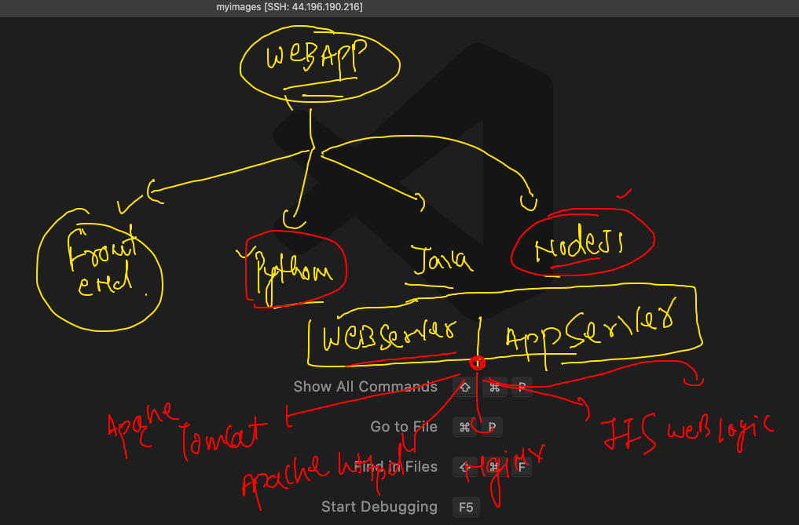
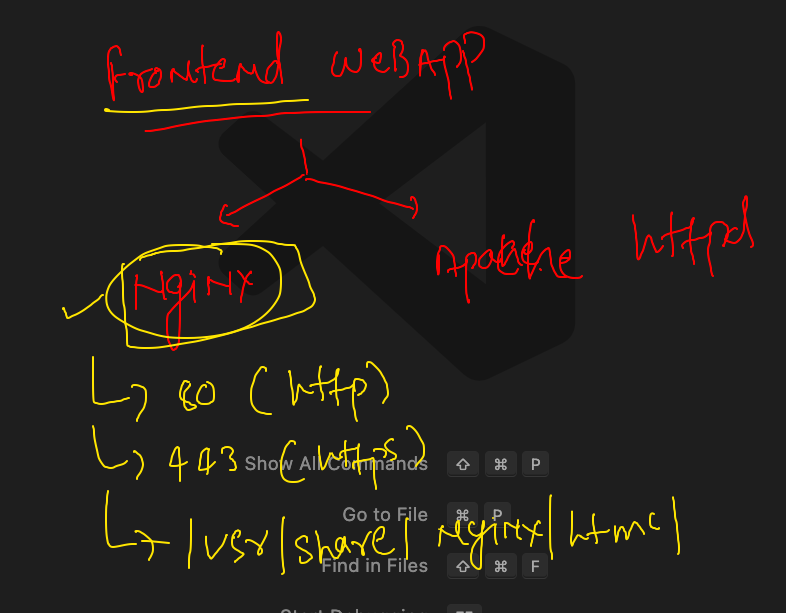
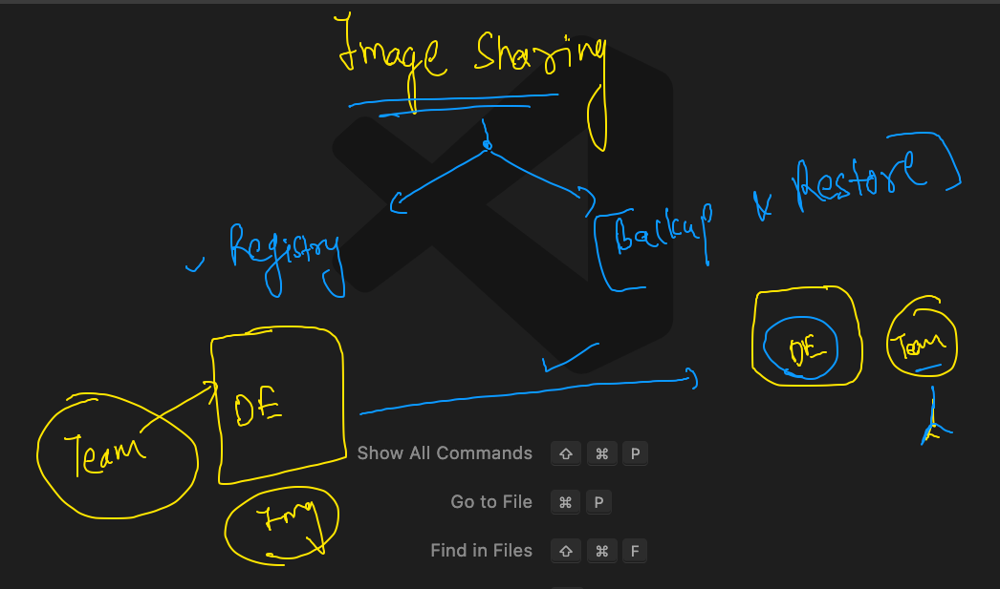
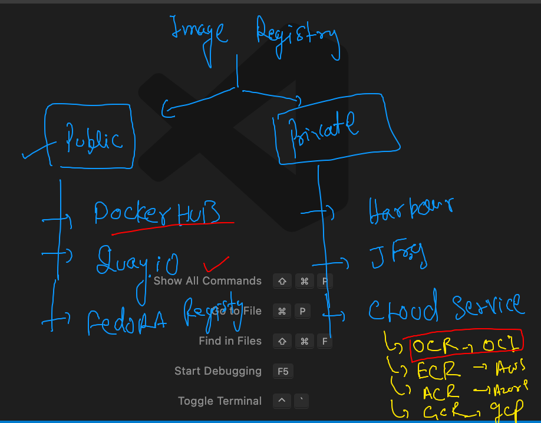
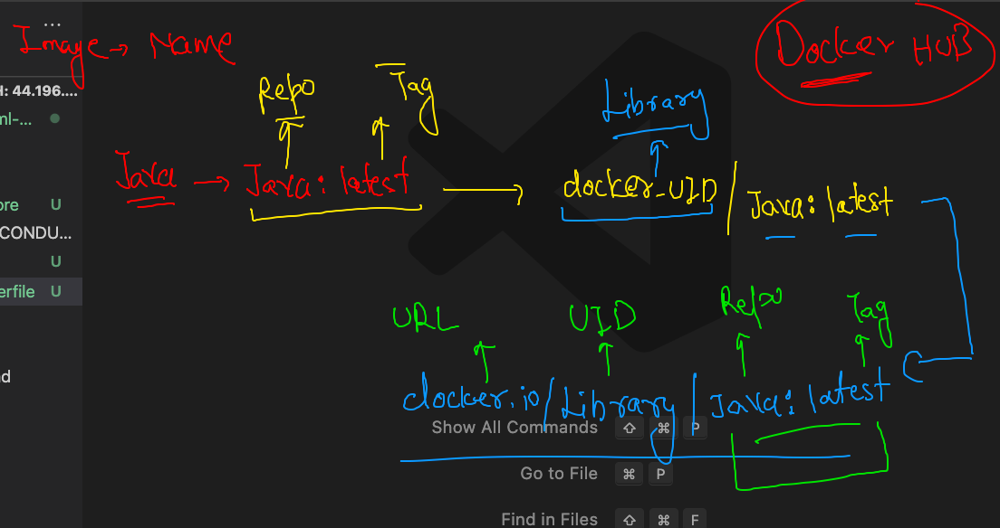
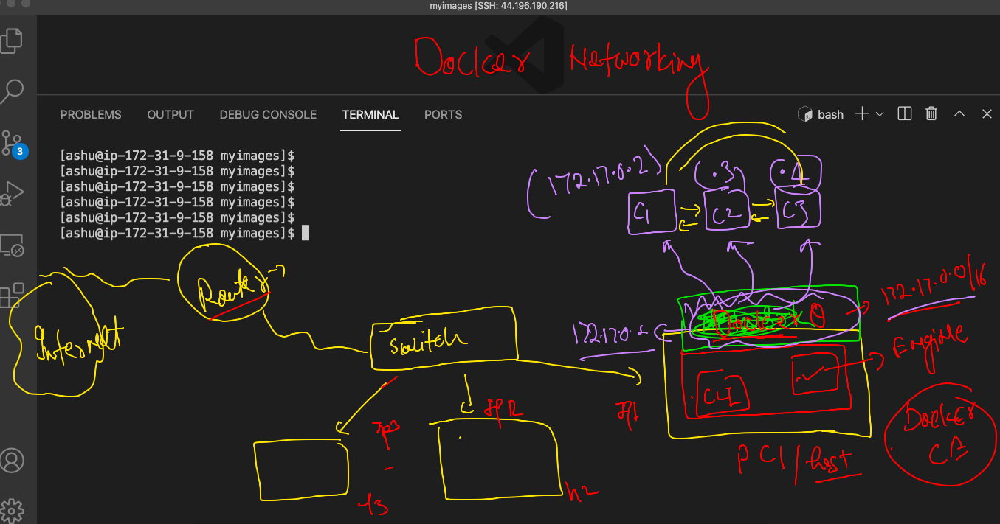
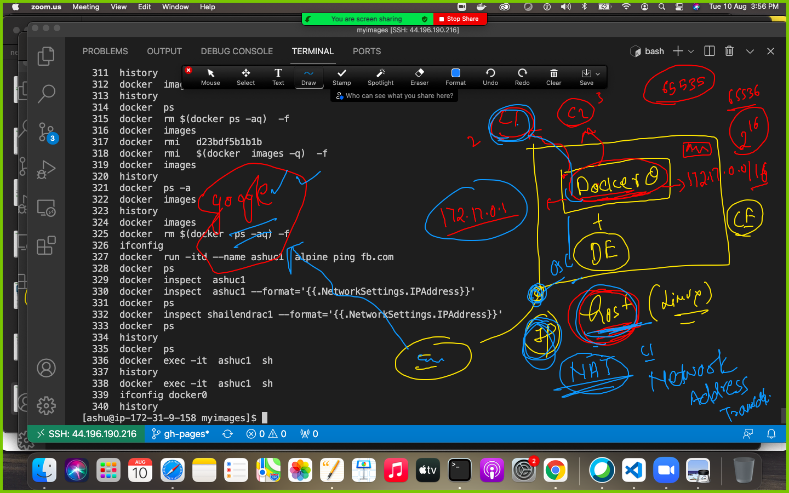
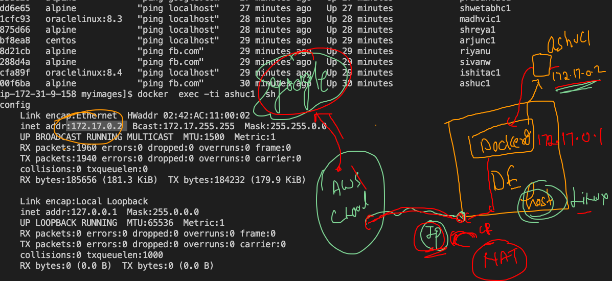
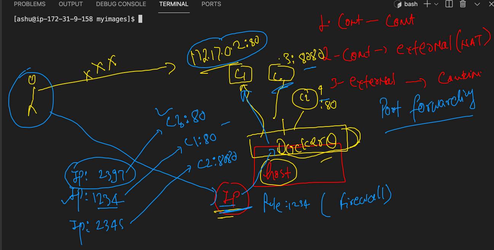
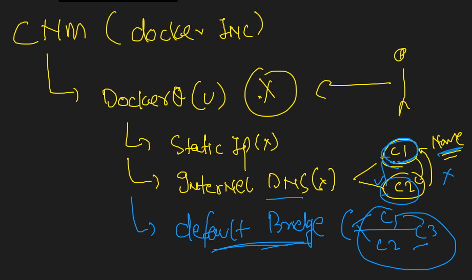

#  Namespace and cgroups 


## to remove all non running container 

```
 docker  rm  $(docker  ps  -aq)
 
 ```
 
## Introduction to vertical scaling of container along with cgroups 


## running child process and check resources 

```
 175  docker  run -itd  --name ashuc1  alpine ping google.com 
  176  docker  ps
  177  history 
  178  docker  stats
  179  history 
  180  docker  exec -itd  ashuc1  ping localhost 
  181  docker  stats
  182  docker  ps
  183  docker  top  ashuc1
  
 ```
 
 ### cgroups for memory limit 
 
 ```
  docker run -itd --name ashuc2 --memory 100m alpine ping fb.com
  
```

### ram with CPU limit

```
docker run -itd --name ashuc3 --memory 100m --cpu-shares=30 alpine ping fb.com

```

##  Restart policy in DOcker containers


### filter json output in container to check restart policy and other info 

```
ashu@ip-172-31-9-158 ~]$ docker  inspect  ashuc1  --format='{.Id}'
{.Id}
[ashu@ip-172-31-9-158 ~]$ docker  inspect  ashuc1  --format='{{.Id}}'
cf7e6d1a06ff1cfba7539cd2876e47faef41fc88459d5735f2add4e2ca88be65
[ashu@ip-172-31-9-158 ~]$ docker  inspect  ashuc1  --format='{{.State.Status}}'
running
[ashu@ip-172-31-9-158 ~]$ docker  inspect  ashuc2  --format='{{.State.Status}}'
running
[ashu@ip-172-31-9-158 ~]$ docker  inspect  ashuc2  --format='{{.HostConfig.RestartPolicy.Name}}'
no
[ashu@ip-172-31-9-158 ~]$ docker  inspect  ashuc1  --format='{{.HostConfig.RestartPolicy.Name}}'
no

```


## java code image building 

```
ashu@ip-172-31-9-158 javaapp]$ ls
Dockerfile  hello.java
[ashu@ip-172-31-9-158 javaapp]$ docker  build -t  ashujava:v1  . 
Sending build context to Docker daemon  3.072kB
Step 1/8 : FROM openjdk
 ---> c9022ce77bf9
Step 2/8 : LABEL name=ashutoshh
 ---> Running in 3fc535eafae9
Removing intermediate container 3fc535eafae9
 ---> 35a137384835
Step 3/8 : LABEL email=ashutoshh@linux.com
 ---> Running in 80aeaa95daa1
Removing intermediate container 80aeaa95daa1
 ---> 3a5ce0c1f7bc
Step 4/8 : RUN mkdir /jcode
 ---> Running in 85eded6c1c9c
Removing intermediate container 85eded6c1c9c
 ---> bfe4cd66a48c
Step 5/8 : COPY  hello.java  /jcode/hello.java
 ---> 86db73944f66
Step 6/8 : WORKDIR  /jcode
 ---> Running in 2abb030c960d
Removing intermediate container 2abb030c960d
 ---> 609edeab7ea4
Step 7/8 : RUN  javac  hello.java
 ---> Running in 3a7fe1e93d9b
Removing intermediate container 3a7fe1e93d9b
 ---> af841d71bb55
Step 8/8 : CMD  ["java","myclass"]
 ---> Running in e60136d6bcfb
Removing intermediate container e60136d6bcfb
 ---> 57f3ff77b778
Successfully built 57f3ff77b778
Successfully tagged ashujava:v1

```

### running java container 

```
[ashu@ip-172-31-9-158 javaapp]$ docker  run -itd --name ashujc1 ashujava:v1
4227d6762093bc45c79d994f56f93fb0fe83e6d5f1d86665aeed074ccc3dc00f
[ashu@ip-172-31-9-158 javaapp]$ docker  ps
CONTAINER ID   IMAGE            COMMAND          CREATED         STATUS         PORTS     NAMES
d5cdbc990ff0   javaappishi:v1   "java myclass"   3 seconds ago   Up 1 second              ishitac2
4227d6762093   ashujava:v1      "java myclass"   6 seconds ago   Up 5 seconds             ashujc1

```

### checking java jdk version inside contianer 

```
[ashu@ip-172-31-9-158 javaapp]$ docker  exec -it  ashujc1   bash 
bash-4.4# 
bash-4.4# 
bash-4.4# 
bash-4.4# 
bash-4.4# 
bash-4.4# 
bash-4.4# java -version 
openjdk version "16.0.2" 2021-07-20
OpenJDK Runtime Environment (build 16.0.2+7-67)
OpenJDK 64-Bit Server VM (build 16.0.2+7-67, mixed mode, sharing)
bash-4.4# exit
exit

```

### creating a temp container 

```
[ashu@ip-172-31-9-158 myimages]$ docker  run -it --rm  oraclelinux:8.4   bash 
[root@d6165548f9f2 /]# 
[root@d6165548f9f2 /]# dnf  search  jdk 
Oracle Linux 8 BaseOS Latest (x86_64)                                                          49 MB/s |  38 MB     00:00    
Oracle Linux 8 Application Stream (x86_64)                                                     54 MB/s |  26 MB     00:00    
Last metadata expiration check: 0:00:18 ago on Tue Aug 10 06:16:27 2021.
================================================ Name & Summary Matched: jdk =================================================
copy-jdk-configs.noarch : JDKs configuration files copier
copy-jdk-configs.src : JDKs configuration files copier
java-1.8.0-openjdk.src : OpenJDK 8 Runtime Environment
java-1.8.0-openjdk.x86_64 : OpenJDK 8 Runtime Environment
java-1.8.0-openjdk-accessibility.x86_64 : OpenJDK 8 accessibility connector
java-1.8.0-openjdk-demo.x86_64 : OpenJDK 8 Demos
java-1.8.0-openjdk-devel.x86_64 : OpenJDK 8 Development Environment
java-1.8.0-openjdk-headless.x86_64 : OpenJDK 8 Headless Runtime Environment
java-1.8.0-openjdk-javadoc.noarch : OpenJDK 8 API documentation
java-1.8.0-openjdk-javadoc-zip.noarch : OpenJDK 8 API documentation compressed in a single archive
java-1.8.0-openjdk-src.x86_64 : OpenJDK 8 Source Bundle
java-11-openjdk.src : OpenJDK 11 Runtime Environment

```

### jdk 

```
ashu@ip-172-31-9-158 myimages]$ cd  javaapp/
[ashu@ip-172-31-9-158 javaapp]$ ls
Dockerfile  hello.java  jdk8.dockerfile
[ashu@ip-172-31-9-158 javaapp]$ docker  build  -t  ashujava:v2  -f  jdk8.dockerfile  . 
Sending build context to Docker daemon  4.608kB
Step 1/9 : FROM oraclelinux:8.4
 ---> 6c0485cb8463
Step 2/9 : LABEL name=ashutoshh
 ---> Running in ae6ca4ee8225
Removing intermediate container ae6ca4ee8225
 ---> b39f11002bee
Step 3/9 : LABEL email=ashutoshh@linux.com
 ---> Running in c1598a53c05c
Removing intermediate container c1598a53c05c
 ---> 15f2382f803f
Step 4/9 : RUN dnf install java-1.8.0-openjdk.x86_64 java-1.8.0-openjdk-devel.x86_64 -y
 ---> Running in 8a2237b0f5e5
Oracle Linux 8 BaseOS Latest (x86_64)            53 MB/s |  38 MB     00:00 

```

## web application containerization 

### web servers



### nginx web server 



### Cloing web app

```
[ashu@ip-172-31-9-158 myimages]$ git clone  https://github.com/mdn/beginner-html-site-styled
Cloning into 'beginner-html-site-styled'...
remote: Enumerating objects: 40, done.
remote: Total 40 (delta 0), reused 0 (delta 0), pack-reused 40
Receiving objects: 100% (40/40), 124.07 KiB | 41.35 MiB/s, done.
Resolving deltas: 100% (10/10), done.
[ashu@ip-172-31-9-158 myimages]$ ls
beginner-html-site-styled  javaapp  pythonapp

```

### building it 

```
[ashu@ip-172-31-9-158 beginner-html-site-styled]$ docker  build -t ashunginx:v1 . 
Sending build context to Docker daemon  63.49kB
Step 1/4 : FROM nginx
 ---> 08b152afcfae
Step 2/4 : LABEL name=ashutoshh
 ---> Running in e55053321865
Removing intermediate container e55053321865
 ---> d2777e760f88
Step 3/4 : WORKDIR /usr/share/nginx/html/
 ---> Running in 17cf3c24d3f9
Removing intermediate container 17cf3c24d3f9
 ---> 8cfb0f016bfe
Step 4/4 : COPY  .  .
 ---> c720ce3d08d3
Successfully built c720ce3d08d3
Successfully tagged ashunginx:v1

```

### same web app with httpd web server dockerfile 

```
ashu@ip-172-31-9-158 beginner-html-site-styled]$ ls
CODE_OF_CONDUCT.md  Dockerfile  httpd.dockerfile  images  index.html  LICENSE  README.md  styles
[ashu@ip-172-31-9-158 beginner-html-site-styled]$ docker  build  -t  ashuhttpd:v1 -f httpd.dockerfile  . Sending build context to Docker daemon  63.49kB
Step 1/5 : FROM oraclelinux:8.4
 ---> 6c0485cb8463
Step 2/5 : RUN dnf install httpd -y
 ---> Running in b8f16d71987f
Oracle Linux 8 BaseOS Latest (x86_64)            69 MB/s |  38 MB     00:00    
Oracle Linux 8 Application Stream (x86_64)       26 MB/s |  26 MB     00:01    
Last metadata expiration check: 0:00:07 ago on Tue Aug 10 08:47:16 2021.
Dependencies resolved.
==================================================================================================
 Package              Arch    Version                                     Repository          Size
==================================================================================================
Installing:
 httpd                x86_64  2.4.37-39.0.1.module+el8.4.0+20024+b87b2deb ol8_appstream      1.4 M
Installing dependencies:
 apr                  x86_64  1.6.3-11.el8                                ol8_appstream      125 k
 apr-util             x86_64  1.6.1-6.el8                                 ol8_appstream      105 k
 httpd-filesystem     noarch  2.4.37-39.0.1.module+el8.4.0+20024+b87b2deb ol8_appstream       39 k
 httpd-tools          x86_64  2.4.37-39.0.1.module+el8.4.0+20024+b87b2deb ol8_appstream      106 k
 mailcap              noarch  2.1.48-3.el8                                ol8_baseos_latest   39 k
 mod_http2            x86_64  1.15.7-3.module+el8.4.0+20024+b87b2deb      ol8_appstream      154 k
 oracle-logos-httpd   noarch  84.3-1.0.1.el8                              ol8_baseos_latest   29 k
Enabling module streams:
 httpd                        2.4                                                                 

Transaction Summary
==================================================================================================
Install  8 Packages

Total download size: 2.0 M
Installed size: 5.4 M
Downloading Packages:
(1/8): oracle-logos-httpd-84.3-1.0.1.el8.noarch 567 kB/s |  29 kB     00:00    
(2/8): apr-util-1.6.1-6.el8.x86_64.rpm          3.5 MB/s | 105 kB     00:00    
(3/8): apr-1.6.3-11.el8.x86_64.rpm              1.5 MB/s | 125 kB     00:00    
(4/8): httpd-filesystem-2.4.37-39.0.1.module+el 2.2 MB/s |  39 kB     00:00    
(5/8): httpd-tools-2.4.37-39.0.1.module+el8.4.0 6.2 MB/s | 106 kB     00:00    
(6/8): httpd-2.4.37-39.0.1.module+el8.4.0+20024  26 MB/s | 1.4 MB     00:00    
(7/8): mod_http2-1.15.7-3.module+el8.4.0+20024+ 7.8 MB/s | 154 kB     00:00    
(8/8): mailcap-2.1.48-3.el8.noarch.rpm           14 kB/s |  39 kB     00:02    
--------------------------------------------------------------------------------
Total                                           712 kB/s | 2.0 MB     00:02     
Running transaction check
Transaction check succeeded.
Running transaction test
Transaction test succeeded.
Running transaction
  Preparing        :                                                        1/1 
  Installing       : apr-1.6.3-11.el8.x86_64                                1/8 
  Running scriptlet: apr-1.6.3-11.el8.x86_64                                1/8 
  Installing       : apr-util-1.6.1-6.el8.x86_64                            2/8 
  Running scriptlet: apr-util-1.6.1-6.el8.x86_64                            2/8 
  Installing       : httpd-tools-2.4.37-39.0.1.module+el8.4.0+20024+b87b2   3/8 
  Running scriptlet: httpd-filesystem-2.4.37-39.0.1.module+el8.4.0+20024+   4/8 
  Installing       : httpd-filesystem-2.4.37-39.0.1.module+el8.4.0+20024+   4/8 
  Installing       : oracle-logos-httpd-84.3-1.0.1.el8.noarch               5/8 
  Installing       : mailcap-2.1.48-3.el8.noarch                            6/8 
  Installing       : mod_http2-1.15.7-3.module+el8.4.0+20024+b87b2deb.x86   7/8 
  Installing       : httpd-2.4.37-39.0.1.module+el8.4.0+20024+b87b2deb.x8   8/8 
  Running scriptlet: httpd-2.4.37-39.0.1.module+el8.4.0+20024+b87b2deb.x8   8/8 
  Verifying        : mailcap-2.1.48-3.el8.noarch                            1/8 
  Verifying        : oracle-logos-httpd-84.3-1.0.1.el8.noarch               2/8 
  Verifying        : apr-1.6.3-11.el8.x86_64                                3/8 
  Verifying        : apr-util-1.6.1-6.el8.x86_64                            4/8 
  Verifying        : httpd-2.4.37-39.0.1.module+el8.4.0+20024+b87b2deb.x8   5/8 
  Verifying        : httpd-filesystem-2.4.37-39.0.1.module+el8.4.0+20024+   6/8 
  Verifying        : httpd-tools-2.4.37-39.0.1.module+el8.4.0+20024+b87b2   7/8 
  Verifying        : mod_http2-1.15.7-3.module+el8.4.0+20024+b87b2deb.x86   8/8 

Installed:
  apr-1.6.3-11.el8.x86_64                                                       
  apr-util-1.6.1-6.el8.x86_64                                                   
  httpd-2.4.37-39.0.1.module+el8.4.0+20024+b87b2deb.x86_64                      
  httpd-filesystem-2.4.37-39.0.1.module+el8.4.0+20024+b87b2deb.noarch           
  httpd-tools-2.4.37-39.0.1.module+el8.4.0+20024+b87b2deb.x86_64                
  mailcap-2.1.48-3.el8.noarch                                                   
  mod_http2-1.15.7-3.module+el8.4.0+20024+b87b2deb.x86_64                       
  oracle-logos-httpd-84.3-1.0.1.el8.noarch                                      

Complete!
Removing intermediate container b8f16d71987f
 ---> 15092cbfdddf
Step 3/5 : WORKDIR /var/www/html/
 ---> Running in 8ee0c96839dc
Removing intermediate container 8ee0c96839dc
 ---> 1083bf11de30
Step 4/5 : ADD . .
 ---> 0af50c421490
Step 5/5 : ENTRYPOINT httpd -DFOREGROUND
 ---> Running in 69271f41c86d
Removing intermediate container 69271f41c86d
 ---> cff0dc1ed1a0
Successfully built cff0dc1ed1a0
Successfully tagged ashuhttpd:v1

```

## Image sharing concept 



## registry options 



## docker image name reality 



## pushing docker image 

### tag

```
docker  tag  ashuhttpd:v1  dockerashu/ashuhttpd:v1 

```

### login 

```
[ashu@ip-172-31-9-158 myimages]$ docker  login -u  dockerashu 
Password: 
WARNING! Your password will be stored unencrypted in /home/ashu/.docker/config.json.
Configure a credential helper to remove this warning. See
https://docs.docker.com/engine/reference/commandline/login/#credentials-store

Login Succeeded

```


### pushing 
```
[ashu@ip-172-31-9-158 myimages]$ docker push  dockerashu/ashuhttpd:v1
The push refers to repository [docker.io/dockerashu/ashuhttpd]
b6049c54d6fb: Pushed 
2a389ed29340: Pushed 
f881259a17a3: Mounted from library/oraclelinux 
v1: digest: sha256:1b3350bcea0b9a5451b2883ca2d4c469f70ed6d4d76ea83b41b3dbcbc280531d size: 951

```

### logout 

```
[ashu@ip-172-31-9-158 myimages]$ docker logout 
Removing login credentials for https://index.docker.io/v1/
```

### Remove image 

```
ashu@ip-172-31-9-158 myimages]$ docker  rmi   d23bdf5b1b1b  
Untagged: java:latest
Untagged: java@sha256:c1ff613e8ba25833d2e1940da0940c3824f03f802c449f3d1815a66b7f8c0e9d
Deleted: sha256:d23bdf5b1b1b1afce5f1d0fd33e7ed8afbc084b594b9ccf742a5b27080d8a4a8
Deleted: sha256:0132aeca1bc9ac49d397635d34675915693a8727b103639ddee3cc5438e0f60a
Deleted: sha256:c011315277e16e6c88687a6c683e388e287

```

### docker images remove all 

```
 docker  rmi   $(docker  images -q)  -f
```


## Docker Networking 

### topology in on prim and docker host as well



## checking container IP 

```
ashu@ip-172-31-9-158 myimages]$ docker  inspect  ashuc1 --format='{{.NetworkSettings.IPAddress}}'
172.17.0.2
[ashu@ip-172-31-9-158 myimages]$ docker  ps
CONTAINER ID   IMAGE             COMMAND             CREATED              STATUS              PORTS     NAMES
5ad4f11214c3   alpine            "ping fb.com"       43 seconds ago       Up 42 seconds                 shailendrac1
7672f433ad20   alpine            "ping google.com"   53 seconds ago       Up 52 seconds                 prasantac1
e343e7dd6e65   alpine            "ping localhost"    About a minute ago   Up About a minute             shwetabhc1
efc1fe1cfc93   oraclelinux:8.3   "ping localhost"    About a minute ago   Up About a minute             madhvic1
e930ba875d66   alpine            "ping localhost"    About a minute ago   Up About a minute             shreya1
749dd7bf8ea8   centos            "ping localhost"    2 minutes ago        Up 2 minutes                  arjunc1
b111048d21cb   alpine            "ping fb.com"       3 minutes ago        Up 3 minutes                  riyanu
e08662288d4a   alpine            "ping fb.com"       3 minutes ago        Up 3 minutes                  sivanw
305a33cfa89f   oraclelinux:8.4   "ping localhost"    3 minutes ago        Up 3 minutes                  ishitac1
16a2ee00f6ba   alpine            "ping fb.com"       3 minutes ago        Up 3 minutes                  ashuc1
[ashu@ip-172-31-9-158 myimages]$ docker  inspect shailendrac1 --format='{{.NetworkSettings.IPAddress}}'
172.17.0.11

```

### each container can connect to outside if Host can do the same 

### NAT  -- network address translation 



### Nat ---




### port forwarding 



### CNM -- docker0 is not recommended 



### checking default bridge 

```
[ashu@ip-172-31-9-158 ~]$ docker  network   ls
NETWORK ID     NAME      DRIVER    SCOPE
9290ed712fb2   bridge    bridge    local
d87275337e54   host      host      local
4ea86dcdaf72   none      null      local
[ashu@ip-172-31-9-158 ~]$ 
[ashu@ip-172-31-9-158 ~]$ 
[ashu@ip-172-31-9-158 ~]$ docker  network    inspect  9290ed712fb2 
[
    {
        "Name": "bridge",
        "Id": "9290ed712fb251c2c2f31d5c3b59d955f11066598a637d36c982a948710cc6ca",
        "Created": "2021-08-10T04:44:08.686923252Z",
        "Scope": "local",
        "Driver": "bridge",
        "EnableIPv6": false,
        "IPAM": {
            "Driver": "default",
            "Options": null,
            "Config": [
                {
                    "Subnet": "172.17.0.0/16",
                    "Gateway": "172.17.0.1"
                }
            ]
        },
        "Internal": false,
        "Attachable": false,
        "Ingress": false,
        "ConfigFrom": {
            "Network": ""
        },
        "ConfigOnly": false,
        "Containers": {
            "16a2ee00f6baace9710455530c62a4e3981a9f9a5cb55a1776f3bab53d0af54b": {
                "Name": "ashuc1",
                "EndpointID": "4f4228f40cf6ee131705e9d21e33b25416bbe50853a7062bc67092257a93599b",
                "MacAddress": "02:42:ac:11:00:02",
                "IPv4Address": "172.17.0.2/16",
                "IPv6Address": ""
            },
            "305a33cfa89f0a9ea674377e1599fb12b8c529164c04a6f0d81a2dbad6c1e11b": {
                "Name": "ishitac1",
                "EndpointID": "659d7ba220f42a397b91ca79b480c4579f8bc7bc8164f0105eab402fef09445a",
                "MacAddress": "02:42:ac:11:00:03",
                "IPv4Address": "172.17.0.3/16",
                "IPv6Address": ""
            },
            "44837795917be005baa89a72158bdca7317921e8b2fda1964aa58de17ed72b05": {
                "Name": "shwetabhx1",
                "EndpointID": "3edd52dd5d010eaeb40c28dbdc51c9b40d84a90466be41accd912a442e41a876",
                "MacAddress": "02:42:ac:11:00:0e",
                "IPv4Address": "172.17.0.14/16",
                "IPv6Address": ""
            },
            "587914f4c0013ed8867919decda8c737afdc662e5acfad697b6a7e7009aa37e1": {
                "Name": "nginxpf",
                "EndpointID": "c60e49ea1307fd83ab37f9c1c7ab8e97b288839dea5ab29974e44cf9b0354a3b",
                "MacAddress": "02:42:ac:11:00:0d",
                "IPv4Address": "172.17.0.13/16",
                "IPv6Address": ""
            },
            "5ad4f11214c3c56e6f744173736d7f358cbba99882b16596675e320fb78eda46": {
                "Name": "shailendrac1",
                "EndpointID": "22716d3d0f372c938abb773637b26611ace9ef472a020371af7260e4b7d5c7a9",
                "MacAddress": "02:42:ac:11:00:0b",
                "IPv4Address": "172.17.0.11/16",
                "IPv6Address": ""
            },
            "749dd7bf8ea864a503777f810995408ef29ebb7b855d7f51727f4e89707d08a7": {
                "Name": "arjunc1",
                "EndpointID": "de12c61628320a83302144bc3c97cac9dd00ae6f10c6909aabd981e94c826943",
                "MacAddress": "02:42:ac:11:00:06",
                "IPv4Address": "172.17.0.6/16",
                "IPv6Address": ""
            },
            "7672f433ad20a56a02ea6939d730f53d00e86be30c914afc121b1723fb0252ed": {
                "Name": "prasantac1",
                "EndpointID": "71c00843ada2b01ddc6c61c69e75036915d2d8fe0b1e2e620d8e5220b41c4f85",
                "MacAddress": "02:42:ac:11:00:0a",
                "IPv4Address": "172.17.0.10/16",
                "IPv6Address": ""
                
                
                
   ```
   
   ### None Bridge
   
   ```
   4ea86dcdaf72   none      null      local
[ashu@ip-172-31-9-158 ~]$ docker  run -it --rm  --network  none  alpine  sh  
/ # 
/ # 
/ # 
/ # ifconfig 
lo        Link encap:Local Loopback  
          inet addr:127.0.0.1  Mask:255.0.0.0
          UP LOOPBACK RUNNING  MTU:65536  Metric:1
          RX packets:0 errors:0 dropped:0 overruns:0 frame:0
          TX packets:0 errors:0 dropped:0 overruns:0 carrier:0
          collisions:0 txqueuelen:1000 
          RX bytes:0 (0.0 B)  TX bytes:0 (0.0 B)

/ # ping  172.17.0.1
PING 172.17.0.1 (172.17.0.1): 56 data bytes
ping: sendto: Network unreachable
/ # ping google.com 
ping: bad address 'google.com'
/ # exit

```

### creating custom bridge

```
[ashu@ip-172-31-9-158 ~]$ docker  network  create  ashubr1
2bdad2901d8b636caf9895e0cc66b3628d1c8cd67b59a37663251c6a48b559c2
[ashu@ip-172-31-9-158 ~]$ docker  network  ls
NETWORK ID     NAME      DRIVER    SCOPE
2bdad2901d8b   ashubr1   bridge    local
9290ed712fb2   bridge    bridge    local
d87275337e54   host      host      local
4ea86dcdaf72   none      null      local
[ashu@ip-172-31-9-158 ~]$ docker  network  inspect  ashubr1
[
    {
        "Name": "ashubr1",
        "Id": "2bdad2901d8b636caf9895e0cc66b3628d1c8cd67b59a37663251c6a48b559c2",
        "Created": "2021-08-10T11:25:28.065606482Z",
        "Scope": "local",
        "Driver": "bridge",
        "EnableIPv6": false,
        "IPAM": {
            "Driver": "default",
            "Options": {},
            "Config": [
                {
                    "Subnet": "172.18.0.0/16",
                    "Gateway": "172.18.0.1"
                }
                
                
  ```
  
  
  ### COntainer with network option 
  
  ```
  [ashu@ip-172-31-9-158 ~]$ docker  run -itd --name ashubrc1  --network ashubr1  alpine ping localhost 
23f174e00cfd3a1ee829722f4832c70f0e8ca1210a1a61fa4545b3c92acfbc47
[ashu@ip-172-31-9-158 ~]$ 
[ashu@ip-172-31-9-158 ~]$ 
[ashu@ip-172-31-9-158 ~]$ docker  run -itd --name ashubrc2  --network ashubr1  alpine ping localhost 
221e44715998aebb81a0c89e3cc84fe9a5f2fd185fa52188858cee0ddd1cc79f
[ashu@ip-172-31-9-158 ~]$ docker  exec -it  ashubrc1 sh 
/ # ping ashubrc2
PING ashubrc2 (172.18.0.3): 56 data bytes
64 bytes from 172.18.0.3: seq=0 ttl=255 time=0.112 ms
64 bytes from 172.18.0.3: seq=1 ttl=255 time=0.083 ms
64 bytes from 172.18.0.3: seq=2 ttl=255 time=0.080 ms
^C
--- ashubrc2 ping statistics ---
3 packets transmitted, 3 packets received, 0% packet loss
round-trip min/avg/max = 0.080/0.091/0.112 ms

```

