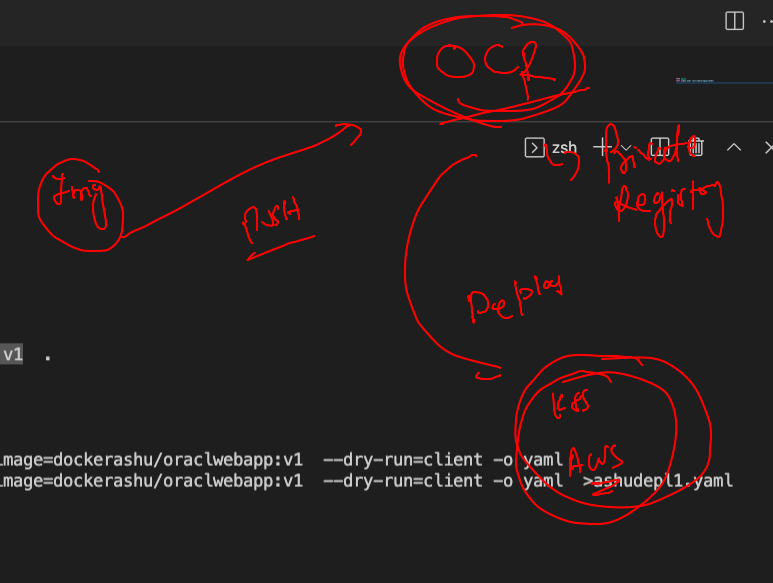
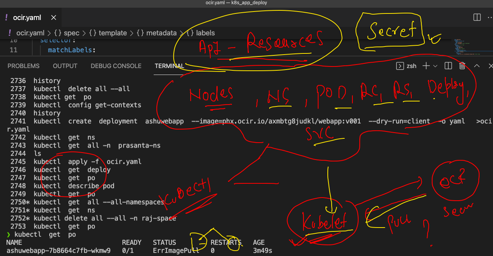
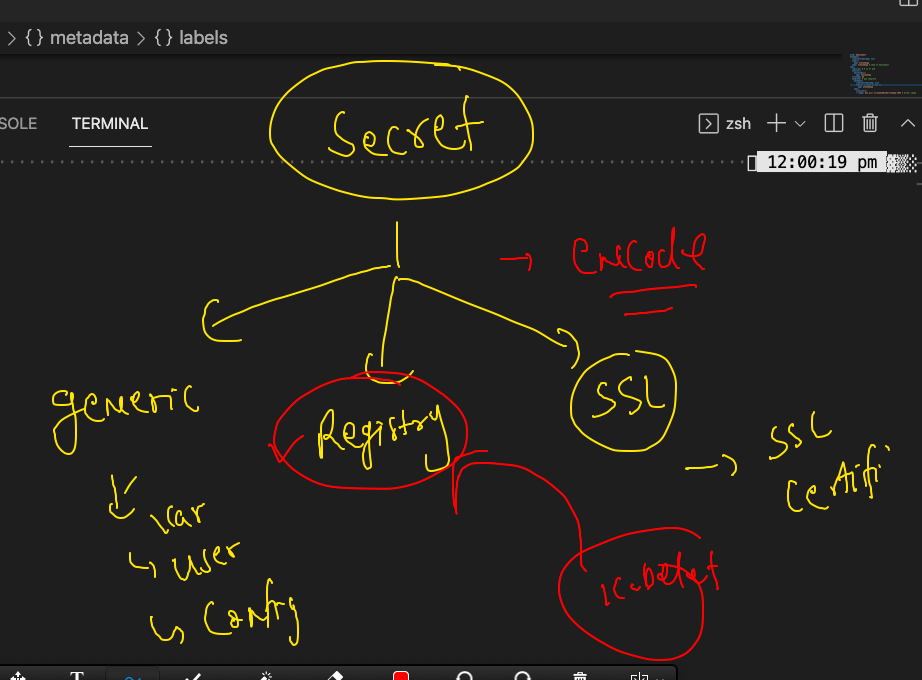
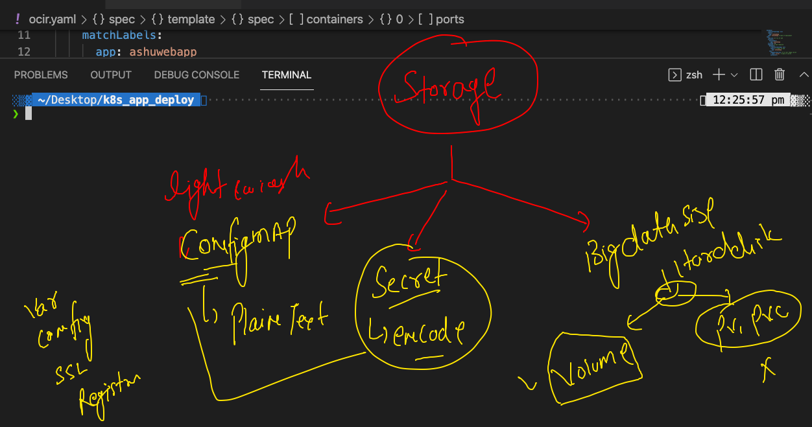
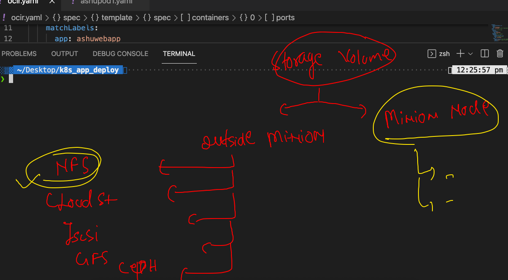
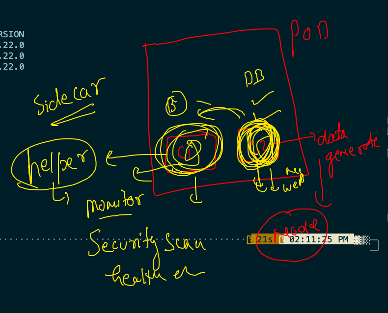

# Certifications 


## k8s architecture 


## cluster setup 


## OCR  to k8s 



## pushing image to OCR 

```
docker  tag  alpine:latest  phx.ocir.io/axmbtg8judkl/webapp:v001
❯ docker  login   phx.ocir.io
Username: axmbtg8judkl/learntechbyme@gmail.com
Password: 
Login Succeeded
❯ docker  push   phx.ocir.io/axmbtg8judkl/webapp:v001
The push refers to repository [phx.ocir.io/axmbtg8judkl/webapp]
cdd2a6afae34: Pushed 
e3135447ca3e: Pushed 
b85734705991: Pushed 
988d9a3509bb: Pushed 
59b01b87c9e7: Pushed 
7c0b223167b9: Pushing [=========================================>         ]  53.52MB/63.91MB
814bff734324: Pushing [=================================>                 ]  46.64MB/69.26MB

❯ docker  logout   phx.ocir.io
Removing login credentials for phx.ocir.io

```


### Creating deployment 

```
kubectl  create  deployment  ashuwebapp  --image=phx.ocir.io/axmbtg8judkl/webapp:v001  --dry-run=client  -o yaml   >ocir.yaml


```

### api-resources in k8s



## Intro to secret 



## creating secret. 

```
❯ kubectl  create  secret   docker-registry  ocrsec   --docker-server phx.ocir.io  --docker-username=a   --docker-password='cc'
secret/ocrsec created
❯ kubectl  get  secret
NAME                  TYPE                                  DATA   AGE
default-token-k7wzh   kubernetes.io/service-account-token   3      20h
ocrsec                kubernetes.io/dockerconfigjson        1      37s

```

### creating service 

```
❯ kubectl  get deploy
NAME         READY   UP-TO-DATE   AVAILABLE   AGE
ashuwebapp   1/1     1            1           4m1s
❯ kubectl  expose deploy  ashuwebapp  --type NodePort  --port 80  --name ashusvc1  --dry-run=client -o yaml
apiVersion: v1
kind: Service
metadata:
  creationTimestamp: null
  labels:
    app: ashuwebapp
  name: ashusvc1
spec:
  ports:
  - port: 80
    protocol: TCP
    targetPort: 80
  selector:
    app: ashuwebapp
  type: NodePort
status:
  loadBalancer: {}
❯ kubectl  expose deploy  ashuwebapp  --type NodePort  --port 80  --name ashusvc1
service/ashusvc1 exposed
❯ kubectl get  svc
NAME       TYPE       CLUSTER-IP      EXTERNAL-IP   PORT(S)        AGE
ashusvc1   NodePort   10.97.144.211   <none>        80:31787/TCP   4s


```

## storage in k8s 



### storage volume options 



[volume docs](https://kubernetes.io/docs/concepts/storage/volumes/)

###  checking pod data 

```
❯ kubectl  get  all
NAME            READY   STATUS    RESTARTS      AGE
pod/ashupodx1   1/1     Running   1 (75m ago)   78m
❯ kubectl  exec -ti  ashupodx1  -- sh
/ # cd  /mnt/oracle/
/mnt/oracle # ls
data.txt
/mnt/oracle # head -5  data.txt 
Hello
Hello
Hello
Hello
Hello
/mnt/oracle # exit


```

### Side car container 




### multi container pod 


##

```
❯ kubectl  get  po
NAME        READY   STATUS    RESTARTS   AGE
ashupodx1   2/2     Running   0          7m44s
❯ kubectl  exec  -it  ashupodx1  -- bash
Defaulted container "ashuc1" out of: ashuc1, ashupodx1
root@ashupodx1:/# cd  /usr/share/nginx/html/
root@ashupodx1:/usr/share/nginx/html# ls
index.html
root@ashupodx1:/usr/share/nginx/html# exit
❯ kubectl  exec  -it  ashupodx1  -c   ashupodx1  -- sh
/ # cd  /mnt/oracle/
/mnt/oracle # ls
index.html
/mnt/oracle # exit

```
