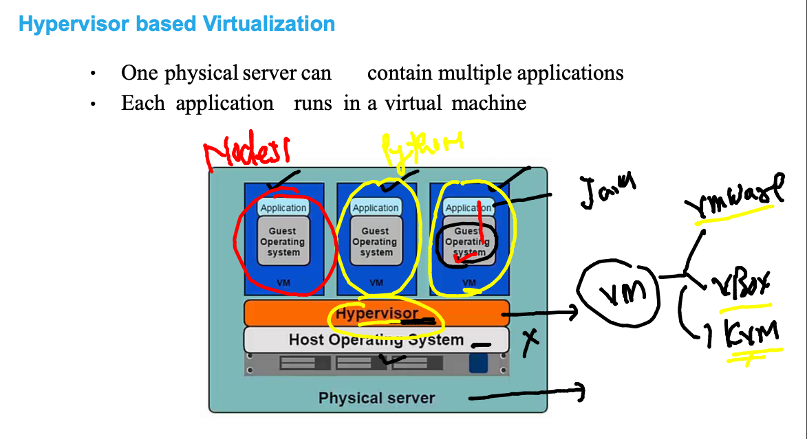
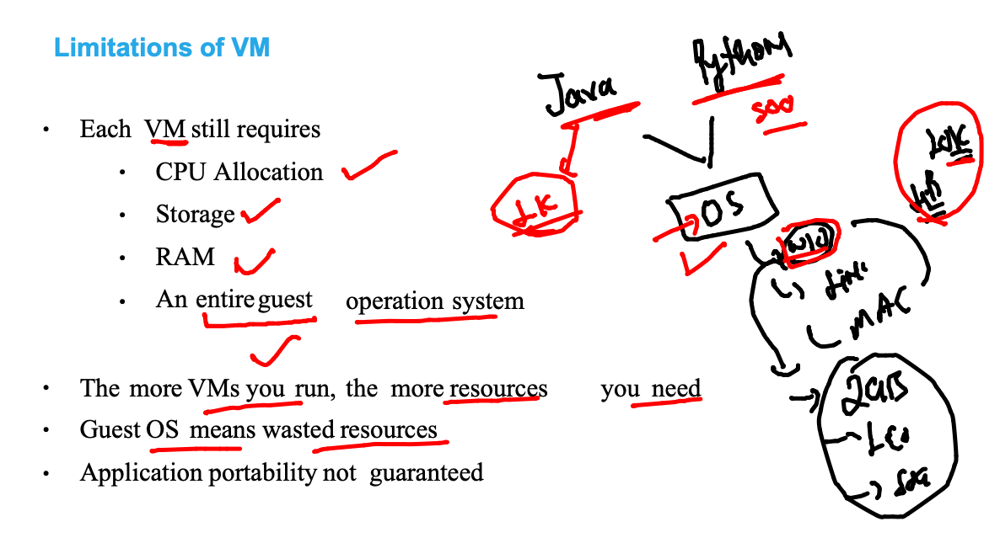
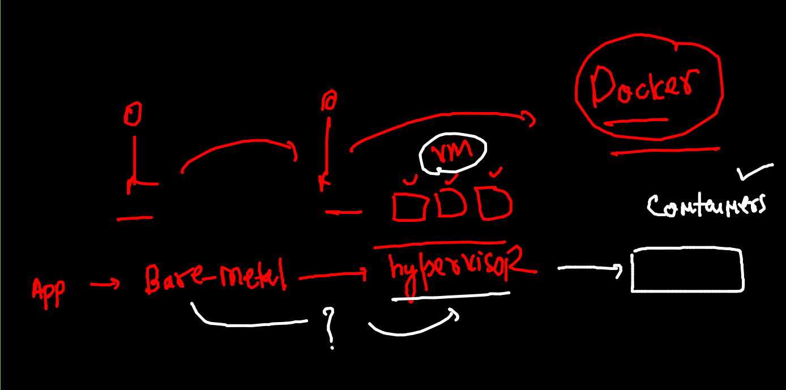
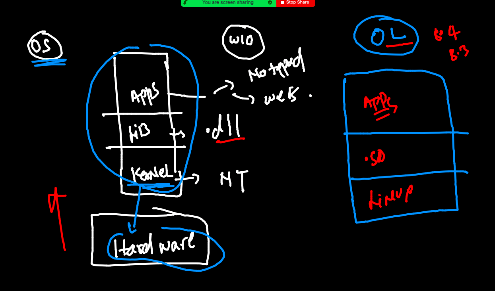
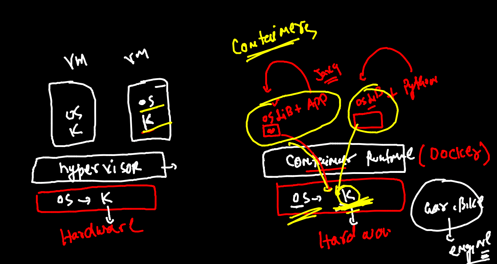
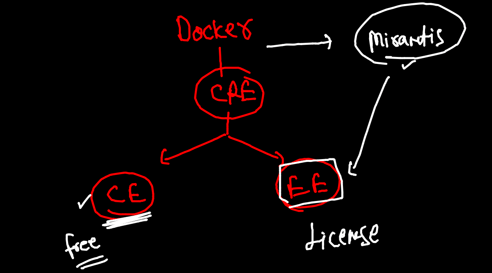
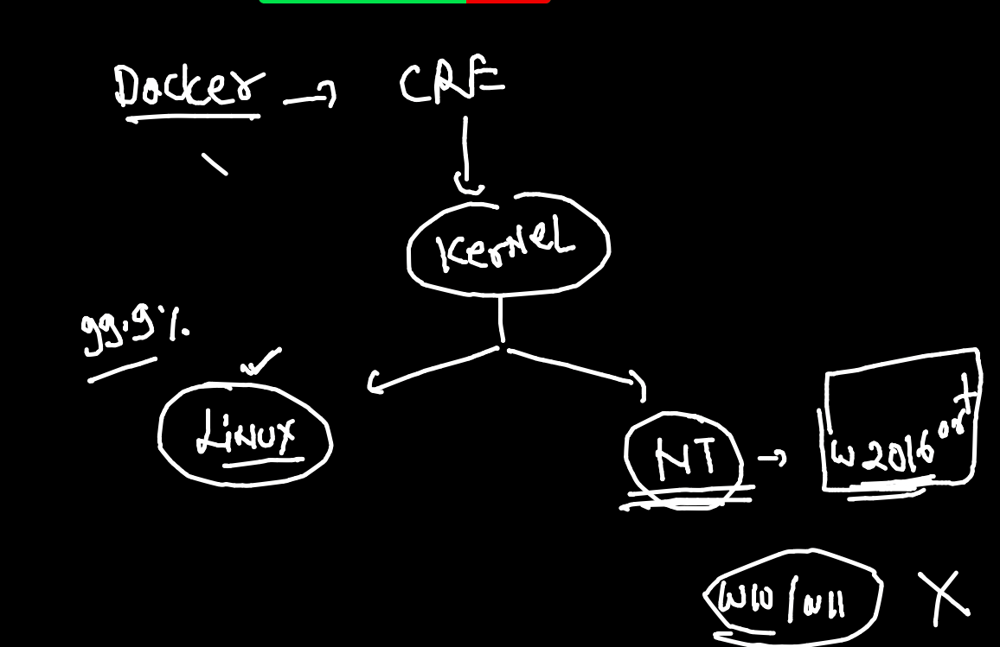
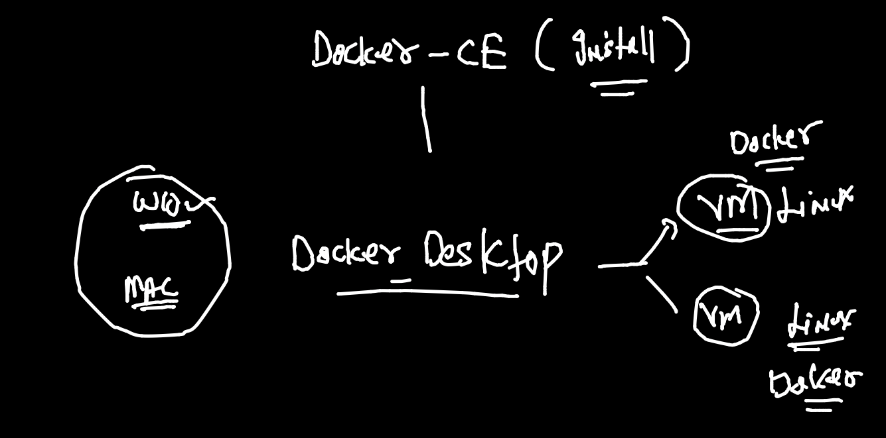

# check day1 to day5 branches for content 

## app deploy problem in past 


## Introduction  to VM 



## limit with vm 



## progress



## understanding oS kernel 



## Understanding little about container



## Introduction to CRE 


## Introduction to DOcker 




## docker start



## Docker Desktop 



## Docker Desktop for windows 10 

['Docker Desktop'](https://docs.docker.com/docker-for-windows/install/)

## Docker. installation on linux manually 

```
[ec2-user@ip-172-31-9-158 ~]$ sudo  yum  install docker  -y 

```

### checking docker version 

```
[ashu@ip-172-31-9-158 ~]$ docker  version 
Client:
 Version:           20.10.4
 API version:       1.41
 Go version:        go1.15.8
 Git commit:        d3cb89e
 Built:             Mon Mar 29 18:54:36 2021
 OS/Arch:           linux/amd64
 Context:           default
 Experimental:      true

Server:
 Engine:
  Version:          20.10.4
  API version:      1.41 (minimum version 1.12)
  Go version:       go1.15.8
  Git commit:       363e9a8
  Built:            Mon Mar 29 18:55:03 2021
  OS/Arch:          linux/amd64
  Experimental:     false
 containerd:
  Version:          1.4.6
  GitCommit:        d71fcd7d8303cbf684402823e425e9dd2e99285d
 runc:
  Version:          1.0.0
  GitCommit:        %runc_commit
 docker-init:
  Version:          0.19.0
  GitCommit:        de40ad0
  
```

## docker arch 


## registry options 


## Docker operations 

### search 

```
[ashu@ip-172-31-9-158 ~]$ docker  search   java 
NAME                                     DESCRIPTION                                     STARS     OFFICIAL   AUTOMATED
node                                     Node.js is a JavaScript-based platform for s…   10368     [OK]       
tomcat                                   Apache Tomcat is an open source implementati…   3089      [OK]       
openjdk                                  OpenJDK is an open-source implementation of …   2867      [OK]       
java                                     Java is a concurrent, class-based, and objec…   1976      [OK]       
ghost                                    Ghost is a free and open source blogging pla…   1398      [OK]       
couchdb                                  CouchDB is a database that uses JSON for doc…   430       [OK]       
jetty                                    Jetty provides a Web server and javax.servle…   369       [OK]       
groovy                                   Apache Groovy is a multi-faceted language fo…   113       [OK]       
lwieske/java-8                           Oracle

```

### pulling images

```
 9  docker  pull  mysql
   10  docker  pull   oraclelinux:8.3 
   11  history 
[ashu@ip-172-31-9-158 ~]$ docker  images
REPOSITORY    TAG       IMAGE ID       CREATED        SIZE
mysql         latest    c60d96bd2b77   2 weeks ago    514MB
oraclelinux   8.3       816d99f0bbe8   3 months ago   224MB

```

### all pulled images

```
[ashu@ip-172-31-9-158 ~]$ docker  images
REPOSITORY    TAG       IMAGE ID       CREATED        SIZE
alpine        latest    021b3423115f   2 days ago     5.6MB
nginx         latest    08b152afcfae   2 weeks ago    133MB
mysql         latest    c60d96bd2b77   2 weeks ago    514MB
busybox       latest    69593048aa3a   2 months ago   1.24MB
oraclelinux   8.3       816d99f0bbe8   3 months ago   224MB

```

