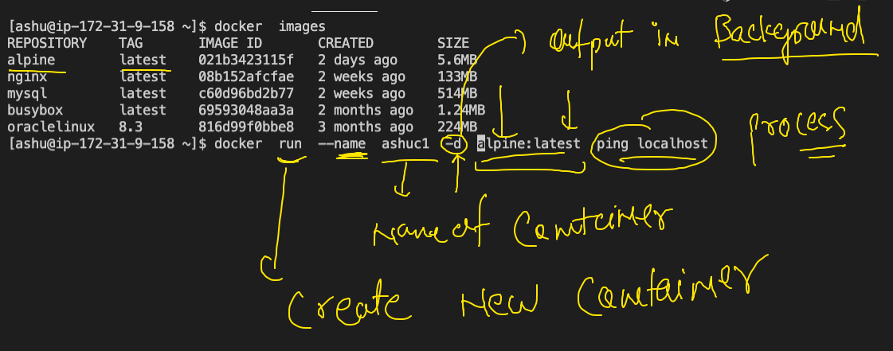

# check day1 to day5 branches for content 

## app deploy problem in past 


## Introduction  to VM 


## limit with vm 


## progress


## understanding oS kernel 


## Understanding little about container


## Introduction to CRE 


## Introduction to DOcker 


## docker start


## Docker Desktop 


## Docker Desktop for windows 10 

['Docker Desktop'](https://docs.docker.com/docker-for-windows/install/)

## Docker. installation on linux manually 

```
[ec2-user@ip-172-31-9-158 ~]$ sudo  yum  install docker  -y 

```

### checking docker version 

```
[ashu@ip-172-31-9-158 ~]$ docker  version 
Client:
 Version:           20.10.4
 API version:       1.41
 Go version:        go1.15.8
 Git commit:        d3cb89e
 Built:             Mon Mar 29 18:54:36 2021
 OS/Arch:           linux/amd64
 Context:           default
 Experimental:      true

Server:
 Engine:
  Version:          20.10.4
  API version:      1.41 (minimum version 1.12)
  Go version:       go1.15.8
  Git commit:       363e9a8
  Built:            Mon Mar 29 18:55:03 2021
  OS/Arch:          linux/amd64
  Experimental:     false
 containerd:
  Version:          1.4.6
  GitCommit:        d71fcd7d8303cbf684402823e425e9dd2e99285d
 runc:
  Version:          1.0.0
  GitCommit:        %runc_commit
 docker-init:
  Version:          0.19.0
  GitCommit:        de40ad0
  
```

## docker arch 


## registry options 


## Docker operations 

### search 

```
[ashu@ip-172-31-9-158 ~]$ docker  search   java 
NAME                                     DESCRIPTION                                     STARS     OFFICIAL   AUTOMATED
node                                     Node.js is a JavaScript-based platform for s…   10368     [OK]       
tomcat                                   Apache Tomcat is an open source implementati…   3089      [OK]       
openjdk                                  OpenJDK is an open-source implementation of …   2867      [OK]       
java                                     Java is a concurrent, class-based, and objec…   1976      [OK]       
ghost                                    Ghost is a free and open source blogging pla…   1398      [OK]       
couchdb                                  CouchDB is a database that uses JSON for doc…   430       [OK]       
jetty                                    Jetty provides a Web server and javax.servle…   369       [OK]       
groovy                                   Apache Groovy is a multi-faceted language fo…   113       [OK]       
lwieske/java-8                           Oracle

```

### pulling images

```
 9  docker  pull  mysql
   10  docker  pull   oraclelinux:8.3 
   11  history 
[ashu@ip-172-31-9-158 ~]$ docker  images
REPOSITORY    TAG       IMAGE ID       CREATED        SIZE
mysql         latest    c60d96bd2b77   2 weeks ago    514MB
oraclelinux   8.3       816d99f0bbe8   3 months ago   224MB

```

### all pulled images

```
[ashu@ip-172-31-9-158 ~]$ docker  images
REPOSITORY    TAG       IMAGE ID       CREATED        SIZE
alpine        latest    021b3423115f   2 days ago     5.6MB
nginx         latest    08b152afcfae   2 weeks ago    133MB
mysql         latest    c60d96bd2b77   2 weeks ago    514MB
busybox       latest    69593048aa3a   2 months ago   1.24MB
oraclelinux   8.3       816d99f0bbe8   3 months ago   224MB

```

### creating a new container 



### check list of running containers

```
[ashu@ip-172-31-9-158 ~]$ docker  ps
CONTAINER ID   IMAGE           COMMAND            CREATED          STATUS          PORTS     NAMES
ab50525e6760   alpine:latest   "ping localhost"   17 seconds ago   Up 16 seconds             ashuc1
```

### checking output of a container 

```
 40  docker  logs  ashuc1  
 
docker  logs  -f  ashuc1  

```

### Container resource consumption 

```
[ashu@ip-172-31-9-158 ~]$ docker  stats  


CONTAINER ID   NAME         CPU %     MEM USAGE / LIMIT     MEM %     NET I/O       BLOCK I/O   PIDS
d3f4a3140887   ishita       0.01%     656KiB / 7.788GiB     0.01%     850B / 0B     0B / 0B     1
6f2c9c68333c   prasct1      0.01%     716KiB / 7.788GiB     0.01%     850B / 0B     0B / 0B     1
84a115bdef61   shailendra   0.01%     744KiB / 7.788GiB     0.01%     850B / 0B     0B / 0B     1
75594a63f6ce   sivaalpine   0.01%     696KiB / 7.788GiB     0.01%     850B / 0B     0B / 0B     1
9551f8989817   madhvic1     0.01%     1.156MiB / 7.788GiB   0.01%     850B / 0B     0B / 0B     1
9de41e467f39   shreyac1     0.01%     724KiB / 7.788GiB     0.01%     850B / 0B     0B / 0B     1
ca1d91898cd8   arjun        0.01%     692KiB / 7.788GiB     0.01%     850B / 0B     0B / 0B     1
c9bbf7d8cadd   shwetabhc1   0.01%     724KiB / 7.788GiB     0.01%     920B / 0B     0B / 0B     1
ab50525e6760   ashuc1       0.01%     720KiB / 7.788GiB     0.01%     1.28kB / 0B   0B / 0B     1

```

### stop a running container 

```
[ashu@ip-172-31-9-158 ~]$ docker  stop   ashuc1   
ashuc1

```

### starting a stopped container

```
[ashu@ip-172-31-9-158 ~]$ docker  start  ashuc1 
ashuc1
[ashu@ip-172-31-9-158 ~]$ docker  ps
CONTAINER ID   IMAGE           COMMAND            CREATED          STATUS         PORTS     NAMES
ab50525e6760   alpine:latest   "ping localhost"   14 minutes ago   Up 7 seconds             ashuc1

```

### login into a running container 

```
[ashu@ip-172-31-9-158 ~]$ docker  exec  -it   ashuc1  sh  
/ # ls 
bin    dev    etc    home   lib    media  mnt    opt    proc   root   run    sbin   srv    sys    tmp    usr    var
/ # ifconfig 
eth0      Link encap:Ethernet  HWaddr 02:42:AC:11:00:02  
          inet addr:172.17.0.2  Bcast:172.17.255.255  Mask:255.255.0.0
          UP BROADCAST RUNNING MULTICAST  MTU:1500  Metric:1
          RX packets:13 errors:0 dropped:0 overruns:0 frame:0
          TX packets:0 errors:0 dropped:0 overruns:0 carrier:0
          collisions:0 txqueuelen:0 
          RX bytes:1030 (1.0 KiB)  TX bytes:0 (0.0 B)

lo        Link encap:Local Loopback  
          inet addr:127.0.0.1  Mask:255.0.0.0
          UP LOOPBACK RUNNING  MTU:65536  Metric:1
          RX packets:918 errors:0 dropped:0 overruns:0 frame:0
          TX packets:918 errors:0 dropped:0 overruns:0 carrier:0
          collisions:0 txqueuelen:1000 
          RX bytes:77112 (75.3 KiB)  TX bytes:77112 (75.3 KiB)

/ # exit

```
### to check all the process running in a container 

```
[ashu@ip-172-31-9-158 ~]$ docker  top  ashuc1
UID                 PID                 PPID                C                   STIME               TTY                 TIME                CMD
root                13999               13957               0                   08:55               ?                   00:00:00            ping localhost

```

### stopping all running containers

```
[ashu@ip-172-31-9-158 ~]$ docker  kill  $(docker  ps -q)
bc7d9dde787b
d6a1e647f43b
00b3af9df8f7
4e55677e3d87
22cc9ea37c10
d80bb9501835
0e25de32b553
a06681663948
a3e596f3c51b
44ff6067f5ad
f9663da6e421
05864e91023f
a3ff9fec69ac
906bce3ccff4
87978d631fd2
fa13f65d88e6
d3f4a3140887
6f2c9c68333c
75594a63f6ce
9551f8989817
9de41e467f39
ca1d91898cd8
c9bbf7d8cadd
[ashu@ip-172-31-9-158 ~]$ docker  ps 
CONTAINER ID   IMAGE     COMMAND   CREATED   STATUS    PORTS     NAMES
[ashu@ip-172-31-9-158 ~]$ 


```

### remove all stopped containers

```
 docker  rm  $(docker  ps -aq) 
 
```


