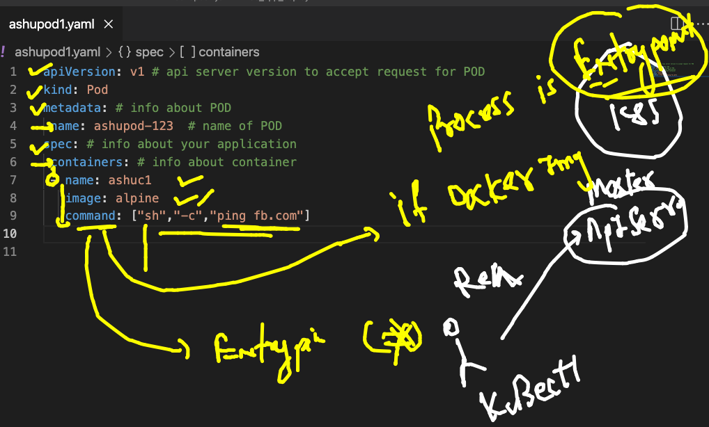
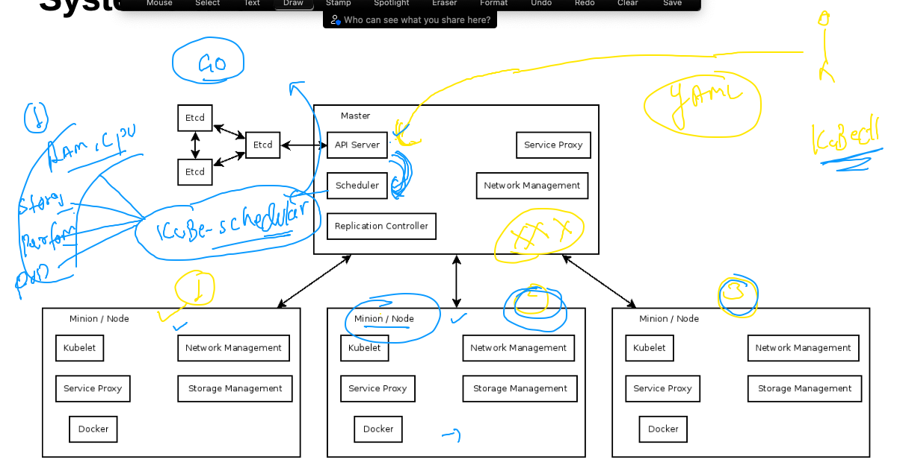
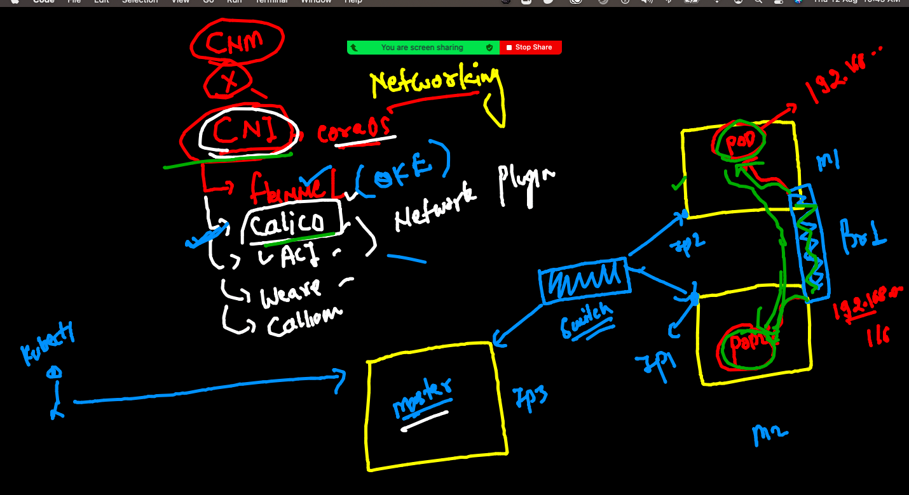
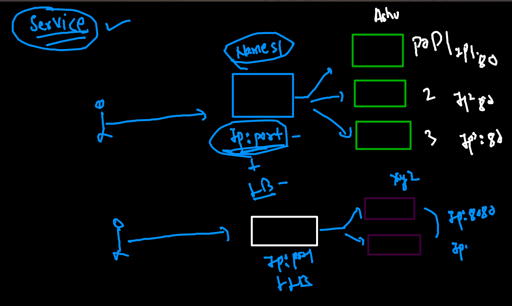
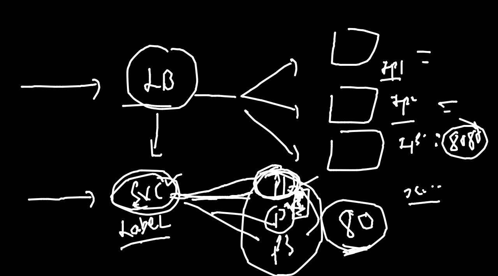
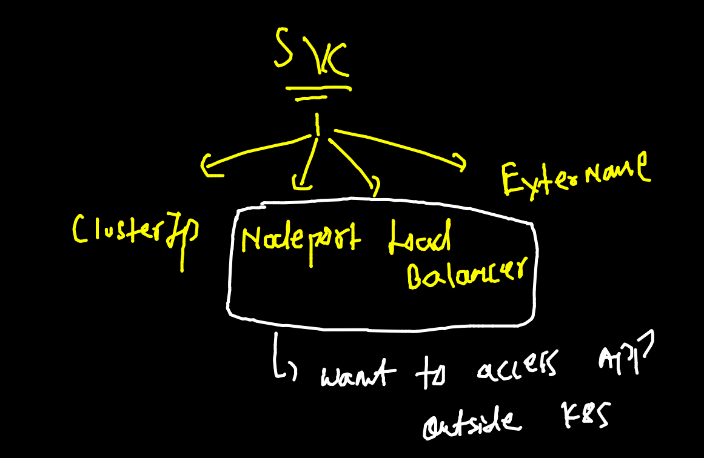
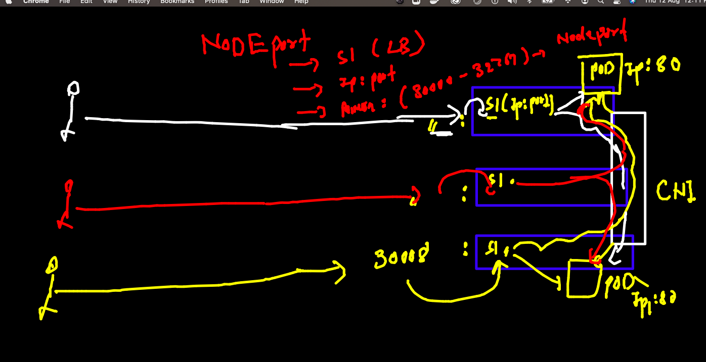

# POD understanding 


## checking k8s connection 

```
❯ kubectl  get  nodes
NAME        STATUS   ROLES                  AGE   VERSION
k8smaster   Ready    control-plane,master   17h   v1.22.0
minion1     Ready    <none>                 17h   v1.22.0
minion2     Ready    <none>                 17h   v1.22.0
❯ kubectl  config get-contexts
CURRENT   NAME                          CLUSTER      AUTHINFO           NAMESPACE
*         kubernetes-admin@kubernetes   kubernetes   kubernetes-admin   
          minikube                      minikube     minikube           default
❯ kubectl  config use-contexts  kubernetes-admin@kubernetes
error: unknown command "use-contexts kubernetes-admin@kubernetes"
See 'kubectl config -h' for help and examples
❯ kubectl  config use-context  kubernetes-admin@kubernetes
Switched to context "kubernetes-admin@kubernetes".
❯ 
❯ kubectl  get  nodes
NAME        STATUS   ROLES                  AGE   VERSION
k8smaster   Ready    control-plane,master   17h   v1.22.0
minion1     Ready    <none>                 17h   v1.22.0
minion2     Ready    <none>                 17h   v1.22.0

░▒▓ ~ ······························································································· 09:48:21 AM ▓▒░─╮
❯                                                                                                                      ─╯


❯ 
❯ 
❯ kubectl  cluster-info
Kubernetes control plane is running at https://52.71.191.102:6443
CoreDNS is running at https://52.71.191.102:6443/api/v1/namespaces/kube-system/services/kube-dns:dns/proxy

To further debug and diagnose cluster problems, use 'kubectl cluster-info dump'.

```

## POD examples 

### example 1 



### checking yaml syntax 

```
❯ kubectl  apply -f  ashupod1.yaml --dry-run=client
pod/ashupod-123 created (dry run)

```

### deploy pod yaml 

```
❯ kubectl  apply -f  ashupod1.yaml
pod/ashupod-123 created
❯ kubectl  get   pods
NAME          READY   STATUS              RESTARTS   AGE
arjunpod      0/1     ContainerCreating   0          0s
ashupod-123   1/1     Running             0          24s

```

## pod scheduling 



### checking node of pod 

```
❯ kubectl  get  po  ashupod-123  -o wide
NAME          READY   STATUS    RESTARTS   AGE    IP                NODE      NOMINATED NODE   READINESS GATES
ashupod-123   1/1     Running   0          9m4s   192.168.179.193   minion2   <none>           <none>

```

## POd internal information 

```
❯ kubectl  describe pod  ashupod-123
Name:         ashupod-123
Namespace:    default
Priority:     0
Node:         minion2/172.31.15.179
Start Time:   Thu, 12 Aug 2021 10:04:07 +0530
Labels:       <none>
Annotations:  cni.projectcalico.org/containerID: 581331b109dc167604b9844955cc4e879f1b013c6caee7e0ff223d5c4b434ab2
              cni.projectcalico.org/podIP: 192.168.179.193/32
              cni.projectcalico.org/podIPs: 192.168.179.193/32
Status:       Running
IP:           192.168.179.193
IPs:
  IP:  192.168.179.193
Containers:
  ashuc1:
    Container ID:  docker://3f2a8b6ae8338a70fec764baec72b99fff9262fc711458ba1181c87ad8412237
    Image:         alpine
    Image ID:      docker-pullable://alpine@sha256:eb3e4e175ba6d212ba1d6e04fc0782916c08e1c9d7b45892e9796141b1d379ae
    Port:          <none>
    Host Port:     <none>
    
    
    
```

### checking logs / output of process of container inside pod 

```
2563  kubectl  logs  ashupod-123 
 2564  kubectl  logs -f  ashupod-123 
 
```
### accessing container inside pod 

```
❯ kubectl  exec  -it  ashupod-123   -- sh
/ # 
/ # 
/ # 
/ # cat  /etc/os-release 
NAME="Alpine Linux"
ID=alpine
VERSION_ID=3.14.1
PRETTY_NAME="Alpine Linux v3.14"
HOME_URL="https://alpinelinux.org/"
BUG_REPORT_URL="https://bugs.alpinelinux.org/"
/ # ls
bin    dev    etc    home   lib    media  mnt    opt    proc   root   run    sbin   srv    sys    tmp    usr    var
/ # exit

```

### POd deletion 

```
❯ kubectl  delete  pod  ashupod-123
pod "ashupod-123" deleted

```

### Auto generate yAMl for POD 

```
❯ kubectl  run ashupod2  --image=dockerashu/ashuhttpd:v1  --port 80  --dry-run=client -o  yaml
apiVersion: v1
kind: Pod
metadata:
  creationTimestamp: null
  labels:
    run: ashupod2
  name: ashupod2
spec:
  containers:
  - image: dockerashu/ashuhttpd:v1
    name: ashupod2
    ports:
    - containerPort: 80
    resources: {}
  dnsPolicy: ClusterFirst
  restartPolicy: Always
status: {}
❯ kubectl  run ashupod2  --image=dockerashu/ashuhttpd:v1  --port 80  --dry-run=client -o  yaml  >ashupod2.yaml

```

### POD networking 



## accessing POD app

### when you are k8s client 

```
❯ kubectl  port-forward  ashupod2   1234:80
Forwarding from 127.0.0.1:1234 -> 80
Forwarding from [::1]:1234 -> 80
Handling connection for 1234
Handling connection for 1234

```

### when you are end user

## enduse need static endpoint 

### Introduction to service 



### svc use label of pod to forward traffic 



## type of service 



### NodePort svc



### checking label of POD 

```
❯ kubectl  get  po  ashupod2  --show-labels
NAME       READY   STATUS    RESTARTS   AGE   LABELS
ashupod2   1/1     Running   0          97m   run=ashupod2
❯ kubectl  apply -f  ashupod2.yaml
pod/ashupod2 configured
❯ kubectl  get  po  ashupod2  --show-labels
NAME       READY   STATUS    RESTARTS   AGE   LABELS
ashupod2   1/1     Running   0          98m   x=helloashuapp


```

### creating service nodeport yaml 

```
❯ kubectl  create  service    nodeport   ashusvc1  --tcp  1234:80   --dry-run=client -o yaml
apiVersion: v1
kind: Service
metadata:
  creationTimestamp: null
  labels:
    app: ashusvc1
  name: ashusvc1
spec:
  ports:
  - name: 1234-80
    port: 1234
    protocol: TCP
    targetPort: 80
  selector:
    app: ashusvc1
  type: NodePort
status:
  loadBalancer: {}
❯ kubectl  create  service    nodeport   ashusvc1  --tcp  1234:80   --dry-run=client -o yaml   >ashusvc.yaml

```

### Deploy svc nodeport 


